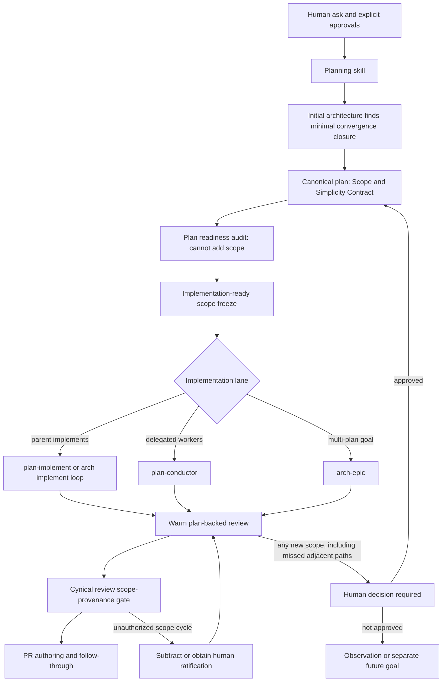

# Architectural Purity and Minimal Convergence Scope

## Executive decision

Make every default planning and plan-backed implementation path obey one law:

> Build exactly the human-authorized outcome with the smallest sufficient
> solution. During the plan's initial architecture pass, pull in only the
> adjacent same-contract areas required to keep the architecture under one
> authoritative owner. Freeze that scope before implementation. After the
> freeze, scope increases only when a human asks for or explicitly approves the
> increase. A worker, reviewer, worklog, plan edit, or already-built code path
> can never authorize it.

The suite should call the initial-planning exception the **minimal convergence
closure**. Architectural purity will mean the smallest robust shape that leaves
one owner for the contract being changed. It will not mean generalized
infrastructure, repo-wide cleanup, a new framework, or solving every
technically real edge a reviewer can imagine.

This should be implemented as a shared semantic contract carried by the
existing skills, not as a new skill, runner, controller, scorecard, or scope
budget. The plan document remains the run-specific source of truth. Planning
logs, conductor logs, implementation logs, reviewer artifacts, and PR comments
remain evidence and coordination surfaces; none of them can mint scope.

The three cynical reviews must also gain a mandatory scope-provenance lens for
plan-backed or history-backed work. They must reconstruct the initial
human-authorized scope, trace every later addition to a valid authority, detect
scope cycling or ratcheting, and hard-fail unauthorized expansion. Reviewers
must not repair that failure by demanding still more infrastructure. The
default repair is subtraction back to the authorized outcome plus minimal
convergence closure frozen by initial planning, unless a human decision owner
explicitly approves the larger outcome after seeing the tradeoff.

The key freeze rule is absolute:

> Initial architecture may discover and include adjacent convergence work.
> Agent review may not increase scope. A post-freeze review can require repair
> of work already inside the frozen contract, require subtraction of
> unauthorized work, or stop for a human scope decision. It cannot add a new
> obligation to the implementation.

The governing set equation is:

```text
Allowed implementation scope
  = human-authorized outcome and constraints
  + minimal convergence closure found by initial plan architecture and frozen
    before implementation
  + later expansion explicitly approved by a human decision owner
```

Nothing else becomes required merely because it is correct, elegant, already
implemented, written into an agent-authored plan revision, requested by an
agent reviewer, or useful in a hypothetical future.

## Why this plan exists

The July 10 root-cause analysis found a recurring chain:

```text
broad agent-authored plan
  -> whole-plan execution contract
  -> repeated perfection and zero-open-finding review
  -> technically real edge promoted into a requirement
  -> new machinery needed for that requirement
  -> new machinery treated as current architecture
  -> later review protects and extends the machinery
```

That chain produced very large implementations for narrow asks. The strongest
measured example reached 121 changed files, 11,646 insertions, and 1,830
deletions after 21 conductor waves and 34 findings. The report concluded that
`plan-conductor` was a scope and correctness amplifier, while the broader
planning and review prompt stack supplied the initial overbreadth. See
`docs/plan_conductor_overbuild_root_cause_2026-07-10.md`.

The current repo already contains much of the right doctrine, but the doctrine
is uneven and the handoffs are porous:

- `miniarch-step` now requires a binding Simplicity Contract and explicitly
  treats overbuilding as a default failure mode
  (`skills/miniarch-step/SKILL.md:39-44`).
- `arch-step` distinguishes requested behavior from architectural convergence,
  but it does not carry the same binding Simplicity Contract and permits nearby
  adopters to broaden when convergence appears necessary
  (`skills/arch-step/SKILL.md:40-61`).
- the shared depth-first doctrine protects a “full known final scope” and an
  expansion map without first requiring proof that every destination item came
  from a human or the minimal convergence exception
  (`skills/_shared/depth-first-planning.md:7-22`).
- `arch-step overbuild-protector` can promote convergence, pattern parity, and
  concrete correctness risks into ship-blocking work. Those are useful design
  considerations, but only convergence of the same changed contract should be
  allowed to expand scope without human approval, and only during initial plan
  architecture before the freeze
  (`skills/arch-step/references/arch-overbuild-protector.md:43-76`).
- `plan-implement` says not to widen silently, then later says to widen from
  proven ground. It does not define which new breadth was authorized and which
  is only a reviewer- or implementer-discovered opportunity
  (`skills/plan-implement/references/progressive-implementation-loop.md:5-22`
  and `:145-172`).
- `plan-conductor` checks whether a plan has observable done-ness, not whether
  that done-ness is proportionate to the original human ask. Its audit then
  accepts any “real, in-scope” finding and repairs until zero accepted findings
  remain, which lets findings expand the effective contract
  (`skills/plan-conductor/references/plan-intake-and-readiness.md:24-47` and
  `skills/plan-conductor/references/audit-and-send-back.md:1-83`).
- `arch-epic` is strict about preventing scope cuts, but its critic currently
  considers an implementation discovery acceptable when an agent added it to
  the phase plan and Decision Log. A Decision Log records provenance; it is not
  human authorization (`skills/arch-epic/references/critic-contract.md:85-108`).
- `cynical-code-review` catches local scope contamination and adjacent drift,
  but it does not reconstruct authorization across plan revisions and review
  waves (`skills/cynical-code-review/references/review-catalog.md:326-349`).
- `cynical-architecture-review` asks which requirement forces complexity, but
  “requirement” can already have been laundered through an agent-authored plan
  or review cycle (`skills/cynical-architecture-review/references/review-lenses.md:13-45`).
- `cynical-cruft-removal` treats a current live root plus current purpose as
  keep evidence. Scope-cycled machinery can become live precisely because an
  agent built it, so liveness cannot by itself prove authorization or value
  (`skills/cynical-cruft-removal/references/cruft-lenses.md:3-28`).
- `pr-review-followthrough` correctly treats reviewer comments as claims, but
  valid feedback can still be accepted because it improves correctness or
  consistency without tracing whether the resulting work expands the approved
  change (`skills/pr-review-followthrough/SKILL.md:39-60`).

The suite therefore needs one symmetric policy: do not cut human-approved
scope; let only initial plan architecture add the minimal adjacent closure that
prevents competing authority for the exact changed contract; then freeze. Any
later increase requires a human.

## Canonical asks and anti-case

These are the three ordinary asks the finished flow must handle well.

1. **Plan a contained change.** “Plan this feature so the architecture is clean,
   but do not turn it into a platform.” The result should name the smallest
   sufficient solution, the exact existing owner, any directly competing path
   that must converge, enough proof, and what must remain unbuilt.
2. **Implement an approved plan.** “Implement this plan and keep it perfectly on
   scope.” The implementer may touch adjacent code only when that convergence
   was named and frozen by the plan's initial architecture. Any adjacent path
   first discovered during implementation or review is new scope and waits for
   a human.
3. **Review a plan-backed implementation.** “Cynically review this branch.” The
   reviewer must catch both under-implementation and unauthorized
   over-implementation. It must hard-fail scope cycling instead of converting
   each new edge into another repair obligation.

The anti-case is a request such as “clean up every similar pattern in the repo”
or “redesign this subsystem for all future variants.” That is a different,
explicitly broad goal. The default contained-change flow must not infer it from
similar code, a review finding, or the desire for architectural purity.

## North Star

### Claim

Every planning, implementation, orchestration, review, and PR handoff can
answer all of these questions without guessing:

- What outcome did a human actually authorize?
- What is the smallest sufficient solution?
- Which adjacent paths implement the exact same changed contract?
- Which of those paths must converge now so the change does not create or
  preserve competing authority?
- What proof is enough?
- What attractive machinery, edge case, or nearby cleanup must remain unbuilt?
- Which later additions were explicitly approved by a human decision owner?

### Definition of done

- All default planning skills write one compact, binding scope-and-simplicity
  contract into their canonical plan artifact.
- All default plan-backed implementation skills consume that contract before
  editing and cannot widen it through a worker, reviewer, audit, or log update.
- The initial architecture pass is the only agent-owned window in which
  adjacent minimal-convergence work may enter scope without a separate human
  request. The closure freezes before implementation.
- After the freeze, no agent review, worker discovery, audit finding, cold
  verifier, or PR comment increases scope. Any new scope requires a human.
- `plan-conductor`, `arch-epic`, and PR follow-through stop scope ratchets at
  their feedback boundaries rather than turning findings into requirements.
- All three cynical reviews detect scope cycling and unauthorized expansion and
  emit a blocking verdict in the vocabulary they already own.
- Existing plans remain readable. Legacy approval entries are interpreted, not
  bulk-rewritten.
- No new skill, controller, runner, score, file-count budget, or wording-locked
  doctrine test is introduced.

### Non-goals

- Do not guarantee zero defects or eliminate engineering judgment.
- Do not forbid refactors that are genuinely required to leave one owner for
  the changed contract.
- Do not turn every technical debt item into current work.
- Do not make all review findings blocking.
- Do not require external model consultation or cynical reviews on every
  ordinary task.
- Do not add a repository-wide architecture cleanup mode to contained feature
  work.
- Do not use line counts, file counts, test counts, phase counts, or complexity
  scores as automatic scope gates.
- Do not create a second scope ledger beside the canonical plan.

## Binding terminology

### Human-authorized outcome scope

The behavior, constraints, supported surfaces, and acceptance result directly
requested by the user or later explicitly approved by a named human decision
owner. A clear human approval of a plan or decomposition counts only when the
scope-expanding consequences were visible in the approval surface.

These are not human authorization:

- an agent-authored plan item;
- an agent-authored Decision Log entry;
- an implementation log or conductor log entry;
- a worker claim;
- a reviewer finding;
- a test that now expects the larger behavior;
- code being live or referenced;
- a PR comment from someone who is not the relevant scope decision owner;
- a generic “continue” or “make it perfect” instruction that did not expose the
  new product or architecture commitment.

### Smallest sufficient solution

The least new behavior, code, concepts, owners, proof, and operational surface
that genuinely satisfies the human-authorized outcome through the correct
owner path. It may be a local change, a direct refactor, or deletion. It is not
necessarily the fewest edited lines.

### Competing authority

Two or more live paths can independently define, write, validate, route,
render, serialize, configure, or teach the same contract, and a future change
could update one while leaving another stale. Similar-looking code is not
enough. The paths must own the same domain fact, invariant, lifecycle, or
public behavior at the same architectural layer.

### Minimal convergence closure

The smallest adjacent set of migrations, caller updates, deletes, or owner
movement required because the narrow solution would otherwise create or
preserve a competing authority for the exact contract being changed.

The closure may increase the plan's initial scope without a separate human ask
only during the initial architecture window and only when all of these are
true:

1. The changed contract and intended canonical owner are named.
2. The competing live paths are evidenced in current repo truth.
3. Leaving those paths untouched would make the changed contract split-brained,
   partially migrated, or dependent on a compatibility side door.
4. The added work routes, migrates, consolidates, or deletes; it does not add a
   new user-visible capability, mode, platform promise, generic extension
   point, or speculative future contract.
5. The proposed boundary is the smallest set that restores one authority.
6. The plan records the closure and delete/cutover result before scope freezes
   and before implementation begins.

If any condition fails, the work is not convergence closure. It needs explicit
human approval or stays out of scope.

### Scope freeze

The initial architecture window covers the planning work that maps current
owners, target ownership, same-contract adjacent paths, call sites, cutover,
deletes, and the phased implementation shape. It ends when the canonical plan
is declared implementation-ready. The Scope and Simplicity Contract is frozen
at that boundary, before the first code edit or delegated implementation
dispatch.

For a legacy or non-canonical plan, the implementing skill must resolve and
record the equivalent frozen boundary at intake before editing. If it cannot,
it stops for a human scope decision.

After the freeze:

- work already named in the human scope or initial minimal convergence closure
  may be implemented and repaired;
- missing implementation inside that frozen boundary is not a scope increase;
- a newly discovered adjacent path, even one that appears to implement the
  same contract, cannot be pulled in by an implementer or reviewer;
- the agent reports the discovery and asks a human whether to expand and
  re-freeze the plan;
- a review may reject the current result, but it may not turn its rejection
  into an automatically accepted repair item outside the frozen boundary.

A pre-implementation plan audit also cannot mint scope. It may mark the plan
not ready and point out that the initial architecture mapping appears
incomplete. If the plan is still in its initial planning window, the planning
owner may re-inspect architecture and revise the draft before freeze; the
review finding itself is not authority. If scope has already frozen, any
addition requires a human.

### Scope expansion

Any new product behavior, guarantee, supported surface, platform, mode,
compatibility promise, operational system, persistent state, dependency,
abstraction family, proof infrastructure, or unrelated cleanup beyond the
human-authorized outcome and frozen initial minimal convergence closure.

An implementation choice inside the existing boundary is not automatically
scope expansion. The distinction is whether the choice creates a new durable
obligation, owner, behavior, or surface that the completed change must now
carry.

### Scope cycling and scope ratcheting

**Scope ratcheting** is monotonic growth after the scope freeze across plan
revisions, worker waves, review findings, or PR comments without valid human
authorization. Initial planning convergence is valid only when it was recorded
before the freeze.

**Scope cycling** is the feedback loop that makes the ratchet look legitimate:

1. an agent or reviewer adds a technically plausible obligation;
2. implementation adds machinery to satisfy it;
3. later review treats that machinery and its edge cases as current truth;
4. a plan, log, test, or status surface records the larger story;
5. the next repair wave protects or extends the story;
6. the cycle repeats until the initial contained ask is no longer recognizable.

Rewording, moving, reopening, deferring, then reintroducing the same
unauthorized obligation is also scope cycling. The test is provenance, not
whether the item appears in the latest plan version.

### Architectural purity

For this suite, architectural purity means:

> The human-authorized outcome is implemented through one obvious owner for
> each changed contract, with the fewest durable concepts that make that owner
> real, and with competing paths removed or deliberately left different for a
> named contract reason.

Purity is not a license to make the whole repository consistent. Pre-existing
impurity outside the changed contract remains an observation or a separately
approved goal.

## Scope decision law

Apply this with a hard distinction between initial planning and everything
after scope freeze.

During initial architecture planning:

1. **Directly authorized:** If the item directly serves the human-authorized
   outcome or an explicit approved constraint, it may be required.
2. **Initial convergence exception:** If it is not directly authorized, ask
   whether omitting it would create or preserve competing authority for the
   exact changed contract. If the full minimal-convergence test passes, include
   only the smallest closure, name the delete or cutover, and expose it in the
   plan before freeze.
3. **Otherwise human decision:** If the item is still desirable but fails the
   test, ask the relevant human decision owner or keep it out of scope.

During implementation, audit, cynical review, cold verification, and PR
follow-through:

1. **Inside frozen scope:** Repair missing or incorrect work already authorized
   by the human outcome or named initial convergence closure.
2. **New discovery:** Do not add it, even when an agent believes it is required
   for cleaner architecture. Report it as a human scope decision. The human may
   approve a revised and re-frozen plan.
3. **Out of scope:** If no human approval is given, record the discovery only
   when it materially matters; do not implement it and do not let repetition
   make it authoritative.
4. **Unauthorized work already exists:** The default required repair is to
   subtract, revert, consolidate, or make the extra surface unreachable. If
   subtraction would itself change an authorized product contract, surface one
   explicit human choice before proceeding.

Correctness does not bypass this law. A real edge that requires a new database
table, queue, state machine, service, cross-device guarantee, compatibility
system, telemetry platform, harness, test category, or operational workflow is
still a scope decision unless it is already in the frozen human scope or the
initial plan's frozen minimal convergence closure. A post-freeze reviewer
cannot classify new work into the closure.

### Examples of allowed convergence

These are allowed only when initial plan architecture finds and records them
before the scope freeze:

- A setting is moved to the canonical preferences owner. One sibling still
  writes the same key directly. Migrating that writer and deleting the direct
  path is required closure.
- A command contract is renamed. The old live alias would remain a second
  supported entrypoint. Removing the alias, or routing an explicitly approved
  timeboxed bridge immediately through the new owner, belongs to the closure.
- A schema becomes the canonical source for generated clients. A hand-written
  duplicate schema for the same endpoint must be deleted or generated from the
  canonical owner.

### Examples that are not allowed convergence

- Refactoring every similar preference in the repository because one setting
  moved.
- Building a generic registry because two local call sites need the same
  helper.
- Adding cross-device ordering guarantees to prevent one low-consequence
  notification edge when the user asked for a local reminder.
- Adding a proof harness, repository taxonomy check, or stale-term CI gate
  because a reviewer wants permanent assurance.
- Fixing a pre-existing split owner for a different contract merely because it
  is nearby.
- Supporting an extra platform, workflow, mode, configuration surface, or
  future variation not named by a human.
- Preserving both old and new paths indefinitely “for safety.” A real active
  compatibility constraint must be explicit and have a decision owner and
  cutover posture.

## Scope provenance contract

Every new or materially repaired plan should keep provenance in the plan
itself, not in a new sidecar. The full-arch form should extend the existing
Section 0 Simplicity Contract into a **Scope and Simplicity Contract** with this
semantic content:

```markdown
### Scope and Simplicity Contract

- Human-authorized outcome: <one concise statement>
- Authorization anchors: <original ask and explicit later human decisions>
- Smallest sufficient solution: <the narrow design>
- Initial minimal convergence closure: <same-contract paths and deletes found by plan architecture, or none>
- Scope freeze: <implementation-ready revision/date or equivalent intake boundary>
- Enough proof: <the evidence that is sufficient>
- Do not build: <tempting machinery, guarantees, and adjacent cleanup excluded>
- Residual risk accepted by this plan: <bounded risk that does not justify expansion>
```

Compact plans may express the same content in fewer lines, but they may not
omit the distinction between human scope and convergence closure.

The existing plan Decision Log remains the only scope-change history. Add two
role-distinct entry shapes rather than a new ledger:

- `Initial convergence closure (planning-derived)` records, before freeze, the
  exact same-contract owner paths, why the narrow edit would be split-brained,
  the minimal closure, and the delete/cutover. It is not available to
  implementation or review agents after freeze.
- `Scope expansion (human-approved)` records the decision owner, the visible
  tradeoff presented, the newly authorized outcome or constraint, and the plan
  sections changed as a result. Post-freeze scope growth always uses this
  shape, including a newly discovered adjacent same-contract path.

Existing `Complexity expansion (user-approved)` entries remain readable as
legacy approval evidence. New plans should write the clearer scope-expansion
shape. Do not bulk-rewrite historical plans.

A plan item cannot bootstrap its own provenance. If an agent adds an item to
Section 7 and later cites Section 7 as authorization, that is scope laundering.
Likewise, updating the Scope and Simplicity Contract after code was built does
not retroactively authorize the work unless a human decision owner explicitly
ratifies it after the expansion is disclosed.

The scope-freeze line prevents review laundering. A reviewer cannot append an
`Initial convergence closure` entry after the recorded freeze, ask a worker to
implement it, and then call it part of the original architecture.

## Mandatory scope-cycling hard fail

The hard-fail rule applies whenever a cynical review has a recoverable human
scope baseline, including plan-backed implementations, branch work tied to a
user ask, conductor runs, Terra final gates, and PR follow-through reviews.

The review must reconstruct:

- the initial human-authorized outcome;
- explicit later human approvals and their decision owners;
- the initial minimal convergence closure and its pre-implementation freeze;
- plan revisions, Decision Log changes, implementation/conductor waves, and PR
  feedback that added obligations;
- durable code, tests, docs, schemas, configs, dependencies, or operational
  surfaces created by those additions;
- any later artifact that treated an agent-authored addition as authority.

Unauthorized growth is a blocking finding even when the added system works and
tests pass.

“Hard fail” means:

- `cynical-code-review` returns `not-approved`;
- `cynical-architecture-review` returns `not-approved`;
- `cynical-cruft-removal` returns `cruft-found` and identifies the unauthorized
  scope cluster as deletion/consolidation work;
- `plan-conductor` cannot accept the slice or close the final gate;
- the Terra delivery shortcut cannot proceed to PR publication or merge-ready;
- `pr-review-followthrough` cannot call the PR merge-ready;
- the finding cannot be deferred merely because removing the work is awkward.

The accepted resolutions are:

1. remove or collapse the unauthorized work back to the authorized outcome and
   frozen initial minimal convergence closure; or
2. obtain explicit approval from the relevant human decision owner after
   presenting the larger behavior, complexity, operational cost, residual
   risk, and smaller alternative, then update the canonical plan.

Reviewer findings themselves never satisfy option 2.

If a review newly discovers an adjacent same-contract path that the initial
architecture missed, the review reports a scope gap and stops for a human
decision. It does not add the path to the closure or send it directly to an
implementation worker. If the path was already named in the frozen closure and
was merely left unimplemented, repairing it is in-scope completion, not an
increase.

When the missed path means the implemented design cannot remain architecturally
clean inside frozen scope, the review still hard-fails—but the repair choices
are explicit: a human approves pulling in the missed area, or the planning and
implementation owners subtract/redesign within the existing frozen boundary so
no competing pattern is introduced. “The reviewer told us to expand” is never
a third choice.

For a plan-backed review whose claimed baseline or approval history should
exist but cannot be recovered, use the review's existing non-approving coverage
verdict (`coverage-incomplete` or `scope-incomplete`) rather than guessing. For
an ordinary standalone subsystem review with no plan, completion claim, or
human-scope history, mark the provenance lane not applicable and continue the
normal architecture or cruft review. Absence of a plan alone is not evidence of
unauthorized scope.

## Intended skill flow



The only agent-owned scope-growth arrow is from initial planning into the
pre-freeze convergence closure. The arrow from review to a human decision does
not let a reviewer edit scope. Only human approval can return post-freeze scope
to the plan, after which the plan is re-frozen before implementation resumes.

## Ownership and handoff boundaries

| Surface | Owns | Must not own |
|---|---|---|
| Human ask and explicit decisions | Product outcome, supported behavior, scope expansion | Technical implementation details that repo truth can settle |
| Canonical plan | Run-specific scope, initial pre-freeze convergence closure, scope-freeze boundary, target owner, phase work, proof, Decision Log | Worker transcripts, reviewer brainstorms, a second hidden scope |
| Shared scope/convergence doctrine | Stable cross-skill definitions and decision law | Run-specific scope or task checklists |
| Plan audit log | Findings and their evidence/disposition | New plan requirements |
| Implementation or conductor log | Progress, proof freshness, claims, findings, resume state | A replacement plan or approval record |
| Worker prompt | A bounded slice of the frozen approved plan and initial closure | New product requirements, newly discovered convergence, or reviewer-led expansion |
| Cynical review artifact | Scope provenance, current-code findings, blocking verdict | Any post-freeze scope increase; review may repair only the frozen contract, subtract, or ask a human |
| PR body and comments | Visible summary, review requests, dispositions | Silent product-scope authority |

## Skill frontier and disposition

This is the complete relevant frontier of shipped skills that can shape a plan,
execute it, review it, or feed findings back into it. Unlisted provider, media,
design, formatting, and account-operation skills do not participate in this
flow.

### Direct behavior changes required

| Skill | Role | Required change |
|---|---|---|
| `arch-step` | Broad canonical planning and embedded implementation | Adopt the binding contract across every command, constrain convergence, and make helper/review commands unable to ratchet scope. |
| `miniarch-step` | Faster canonical planning and embedded implementation | Refine the existing Simplicity Contract into the shared scope/provenance model and preserve its strong anti-overbuild behavior. |
| `arch-mini-plan` | One-pass plan producer | Emit and freeze the compact contract and reject breadth not authorized or required by initial architecture convergence. |
| `lilarch` | Small-feature plan and local implementation | Carry the compact contract through start, plan, finish, and self-audit. |
| `arch-epic` | Multi-plan decomposition and critic loop | Make scope discipline symmetric, require provenance for additions, and hard-fail cross-sub-plan scope cycling. |
| `plan-audit` | Preflight and plan-backed code review | Add a required scope-provenance/minimal-convergence lens, block plan-laundered requirements, and forbid the audit from adding scope. |
| `plan-implement` | Local plan implementation | Resolve and freeze the contract before editing, execute only its named closure, and prevent warm review from minting work. |
| `plan-conductor` | Delegated plan implementation | Add proportionality/readiness intake, scope authority to every slice and finding, a ratchet breaker per wave, and scope-aware final gates. |
| `arch-step-goal-prompt` | Durable goal prompt | Point to the plan's scope contract and add unauthorized review expansion/scope cycling as false-finish lines without copying the plan. |
| `prompt-authoring` | Goal and reviewer prompt doctrine | Teach scope provenance and the rule that signoff/rejection is evidence, not scope authority. |
| `cynical-code-review` | Implementation-integrity review | Add mandatory provenance/cycle detection and a `not-approved` hard fail. |
| `cynical-architecture-review` | Subtraction-first architecture review | Require every durable concept to trace to human scope or the frozen initial closure and hard-fail unauthorized architecture. |
| `cynical-cruft-removal` | Low-value/deletion review | Treat live-but-unauthorized scope-cycled machinery as cruft and make it a blocking deletion cluster. |
| `pr-authoring` | Publish the change | Expose a compact plan-backed scope receipt in the PR body without duplicating the plan. |
| `pr-review-followthrough` | Review feedback and repair loop | Prevent PR comments from ratcheting scope and keep unauthorized work from merge-ready. |
| `bugs-flow` | Contained bug analysis/fix/review | Let initial bug architecture name minimal convergence before fixing; after fix starts, reviews cannot broaden it. |

### Small routing or documentation alignment

| Skill | Disposition |
|---|---|
| `arch-flow` | Surface a missing or violated scope contract as a pending readiness condition, then route to the governing skill; do not become another readiness engine. |
| `arch-skills-guide` | Keep routing unchanged. Update its explanatory map only if needed to state that all fixed-scope plan lanes share the same scope law. |
| `arch-docs` | No behavioral change. It receives a completed plan after code audit and must not become a scope repair lane. |

### Supporting skills that should not own this policy

| Skill | Why it remains a peer or input rather than a mutation target |
|---|---|
| `agent-delegate` | It is execution plumbing. `plan-conductor` owns the scope-rich worker prompt; duplicating architecture policy in generic delegation would create another truth. Its existing smallest-task and no-expand boundaries should be verified only. |
| `agent-history` | It can supply evidence when reconstructing scope cycles, but reviews must also work from plan/git artifacts and cannot require session history. |
| `fresh-consult` | Optional advice only. A consult output cannot authorize scope or become mandatory by default. |
| `model-consensus` | Optional adversarial simplification only. Consensus cannot widen the human-approved outcome. Caller prompts carry the contract. |
| `codex-review-yolo` | Explicit fresh-eyes review remains separate. Its findings are evidence and must be triaged by the invoking flow. |
| `exhaustive-code-review` | Coverage is its deliverable. It should not be silently promoted into the default fixed-scope flow, and the user specifically requested the hard-fail behavior in the cynical reviews. |
| `thermo-nuclear-code-quality-review` | Explicit-only maintainability review. It cannot redefine product scope. |
| `stepwise` | Executes foreign ordered processes and owns different artifacts. Do not make it a second plan-conductor implementation path. |
| `skill-authoring` | Governs how this change is authored: lean packages, distinct peers, no harness, and runtime-first doctrine. Its own runtime job does not need to change. |
| `skill-flow` | Governs this cross-skill flow design. It should not become a runtime stage in the resulting flow. |

### Separate broad or open-ended workflows to audit but not automatically rewrite

| Skill | Boundary decision |
|---|---|
| `audit-loop` | Its user-authorized scope is deliberately repo-wide risk reduction and it already forbids contract changes. Verify that it does not use fixed-scope plan terminology; do not force it through the contained-feature contract. |
| `audit-loop-sim` | Same: broad automation-risk work is its explicit goal. Keep its existing same-story/no-new-framework limits. |
| `goal-loop` | Open-ended optimization has an outcome but not a fixed implementation path. Do not pretend it is a fixed-scope architecture plan. |
| `north-star-investigation` | Investigation may broaden hypotheses but must not silently become product implementation. Existing routing already separates it. |

If later scenario testing finds a direct contradiction in one of these separate
flows, repair only that contradiction. Do not copy the full fixed-scope
contract into every shipped skill merely for textual consistency.

## Target architecture

### One shared semantic owner

Create `skills/_shared/scope-and-convergence.md` as the canonical semantic
reference for:

- human-authorized scope;
- smallest sufficient solution;
- competing authority;
- initial minimal convergence closure and scope freeze;
- scope expansion and approval;
- scope cycling/ratcheting;
- finding dispositions;
- the hard-fail rule.

This is justified shared infrastructure: without one owner, at least six
planning/implementation/review packages would each define the central exception
slightly differently, recreating the competing-contract problem this work is
meant to solve. The existing install surface already copies `skills/_shared/`
for Codex/agents, Claude Code, and Gemini.

Keep the shared file short and decision-oriented. It must not become a giant
review catalog, workflow engine, plan template, or history essay. Each skill
still carries one concise role-specific rule in `SKILL.md` and links to the
shared reference for definitions. Package-local references own role-specific
execution details.

### One run-specific scope owner

The canonical plan's Section 0 or compact equivalent owns the run-specific
Scope and Simplicity Contract. Do not create a `_SCOPE_LEDGER.md`, JSON scope
schema, scorecard, or conductor-only copy.

Logs may cache anchors such as “Scope contract: plan Section 0” and record
finding provenance. They may not restate the contract in a way that can drift.

### Review outputs remain findings, not requirements

Every plan-backed finding should carry a scope disposition:

- `authorized`: directly required by the human scope;
- `frozen-convergence-required`: already named by the initial architecture in
  the pre-implementation closure;
- `new-scope-needs-human`: discovered after freeze, including a newly noticed
  same-contract adjacent path;
- `out-of-scope`: real but not required now;
- `unauthorized-built-scope`: already implemented without authority and must be
  subtracted or human-ratified.

These are prose judgment categories, not a new machine protocol. Existing
finding IDs and verdict vocabularies stay in place.

## Implementation phases

### Phase 1 — Establish the canonical contract and artifact shape

#### Outcome

One semantic owner exists, depth-first planning cannot invent its destination
map, and the full-arch artifact has a stable scope/provenance home.

#### Files

- create `skills/_shared/scope-and-convergence.md`;
- update `skills/_shared/depth-first-planning.md`;
- update:
  - `skills/arch-step/references/artifact-contract.md`;
  - `skills/arch-step/references/shared-doctrine.md`;
  - `skills/arch-step/references/section-quality.md`;
  - `skills/miniarch-step/references/artifact-contract.md`;
  - `skills/miniarch-step/references/shared-doctrine.md`;
  - `skills/miniarch-step/references/section-quality.md`.

#### Required changes

1. Add the definitions and decision law from this plan to the shared reference
   in compact runtime language.
2. Change “destination map” to mean the full human-authorized outcome plus
   initial architecture's recorded minimal convergence closure—not every final
   idea known to the planner or a later reviewer.
3. State that an expansion map sequences already-authorized breadth; it does
   not authorize new callers, variants, modes, or guarantees.
4. Extend the existing Miniarch Simplicity Contract into the Scope and
   Simplicity Contract without adding a second canonical block.
5. Give `arch-step` the same binding contract instead of leaving the strongest
   anti-overbuild behavior only in `miniarch-step`.
6. Add the two Decision Log entry meanings and legacy-read rule.
7. Add one visible scope-freeze boundary at implementation readiness. The
   initial planning closure cannot be edited by an agent after this point.
8. Make unresolved scope provenance or an unbounded convergence claim a
   readiness failure.

#### Proof gate

- Both full-arch artifact contracts point to the same shared semantic owner.
- A plan cannot enter implementation without a frozen initial convergence
  closure, including an explicit `none` when no adjacent path is needed.
- A reader can classify the contained setting example, the competing-writer
  example, and the cross-device notification example without consulting a
  second file or inventing a budget.
- No new marker block, ledger, script, or schema is needed for ordinary plans.

### Phase 2 — Make every fixed-scope planner produce the contract

#### Outcome

Broad, trimmed, one-pass, small-feature, enhanced, folded-in, and goal-prompted
plans all preserve the same human scope and minimal-convergence boundary.

#### `arch-step`

Update `skills/arch-step/SKILL.md`, `agents/openai.yaml`, and the command
references that can create, widen, validate, or execute plan truth:

- `arch-new.md` and `arch-reformat.md`: capture the human baseline and draft
  the contract before confirmation;
- `arch-research.md`, `arch-deep-dive.md`, and `arch-external-research.md`:
  treat discovered patterns, risks, and external advice as evidence, never
  scope authority;
- `arch-phase-plan.md`: require every ship-blocking item to map to human scope
  or convergence discovered by the initial architecture pass, freeze that
  boundary at readiness, and keep observations outside Section 7;
- `arch-plan-enhance.md` and `arch-fold-in.md`: prevent imported suggestions,
  reviews, or source docs from silently becoming required scope;
- `arch-overbuild-protector.md`: keep only the explicit-ask and true
  minimal-convergence expansion lanes. Pattern parity and concrete correctness
  risk may shape an in-scope implementation, but they cannot broaden scope on
  their own;
- `arch-consistency-pass.md`: detect scope laundering and scope cycling across
  TL;DR, Section 0, target architecture, Section 7, proof, and Decision Log;
- `arch-review-gate.md`: require finding scope disposition and reject reviewer
  expansion as a gate obligation. A newly discovered adjacent path becomes a
  human decision, not an automatic plan edit;
- `arch-auto-plan.md`, `full-auto.md`, `status.md`, and `advance.md`: do not
  declare readiness while the contract is missing, contradicted, or exceeded;
- `arch-implement.md`, `arch-implement-loop.md`, and
  `arch-audit-implementation.md`: enforce the contract during code work and
  treat unauthorized additions as subtraction work.

#### `miniarch-step`

Apply the same semantics to `skills/miniarch-step/SKILL.md`,
`agents/openai.yaml`, and its corresponding planning, implementation, audit,
status, and advance references. Preserve the existing strong anti-overbuild
language. Replace only the ambiguity around whether all expansion needs human
approval: planning-derived minimal convergence is allowed before the readiness
freeze; all post-freeze expansion requires human approval.

Do not mechanically force the broader `arch-step` helper-command surface into
Miniarch. The shared law is common; command surfaces remain distinct.

#### `arch-mini-plan`

Update:

- `skills/arch-mini-plan/SKILL.md`;
- `references/artifact-contract.md`;
- `references/one-pass-plan.md`;
- `references/quality-bar.md`;
- `references/fit-and-escalation.md` only where escalation wording depends on
  scope breadth;
- `agents/openai.yaml`.

The one-pass planner must write the compact contract, keep the call-site audit
limited to the requested contract plus initial minimal closure, freeze it at
the ready verdict, and escalate because decisions are unresolved—not merely
because the agent imagined more work.

#### `lilarch`

Update:

- `skills/lilarch/SKILL.md`;
- `references/doc-contract.md`;
- `references/start.md`;
- `references/plan.md`;
- `references/finish.md`;
- `references/quality-bar.md`;
- `references/shared-doctrine.md`;
- `agents/openai.yaml`.

The compact requirements/plan-audit surface must show the human outcome,
initial minimal closure or `none`, the freeze boundary, enough proof, residual
risk, and excluded machinery. Finish mode may implement only the closure that
was frozen before it began; it may not discover and add a new one.

#### Goal and prompt surfaces

Update:

- `skills/arch-step-goal-prompt/SKILL.md`;
- `skills/arch-step-goal-prompt/references/arcstep-goal-prompt-contract.md`;
- `skills/prompt-authoring/references/codex-goal-prompts.md`;
- the relevant prompt-authoring high-leverage and audit guidance only where it
  owns reviewer or completion prompt behavior.

Add two false-finish lines:

- an agent-authored plan revision or reviewer finding was treated as human
  scope authority;
- the goal kept “repairing” review findings until the implementation exceeded
  the initial scope.

Goal prompts should point to the plan's contract, not copy it.

#### `plan-audit`

Update:

- `skills/plan-audit/SKILL.md`;
- `references/progressive-audit-order.md`;
- `references/review-lenses.md`;
- `references/architecture-quality-canon.md`;
- `references/implementation-audit-mode.md`;
- `references/output-contract.md`;
- `references/audit-log-contract.md` and `child-prompt-contract.md` where
  finding provenance or child slices need it;
- `references/examples.md`;
- `agents/openai.yaml`.

Add a required `scope-provenance-and-minimal-convergence` lens. Before a
readiness verdict, it must:

- recover the human baseline and explicit approvals;
- map every durable plan obligation to human scope or the initial architecture's
  pre-freeze convergence closure;
- reject “the plan says so” as circular authority;
- distinguish directly competing same-contract paths from merely similar
  neighboring code;
- block speculative proof or infrastructure;
- name the smallest plan gap rather than rewriting scope itself;
- never add an adjacent area to the plan from the audit. If initial planning is
  still open, route the gap back to the planning owner for architecture
  re-inspection before freeze. If scope is frozen, require a human decision.

In implementation-audit mode, unauthorized implemented scope is a blocking
`IMP-*` finding even when the plan was later edited to match it without human
approval.

#### Proof gate

Run the scenario matrix in this plan as a human judgment exercise against each
plan-producing lane. The same ask must produce the same scope boundary in
full-arch, Miniarch, one-pass, and Lilarch form even though their artifact
detail differs.

### Phase 3 — Close implementation and orchestration ratchets

#### Outcome

Implementation may discover facts but cannot silently turn them into scope.
Workers and reviewers cannot trigger new minimal convergence after freeze. They
can repair the already frozen closure, request a human scope decision, record
an observation, or require subtraction—never automatic expansion by
repetition.

#### `plan-implement`

Update:

- `skills/plan-implement/SKILL.md`;
- `references/artifact-contract.md`;
- `references/progressive-implementation-loop.md`;
- `references/continuous-review.md`;
- `references/native-subagent-contract.md`;
- `references/output-contract.md` and `examples.md`;
- `agents/openai.yaml`.

Required behavior:

1. Resolve the plan's human baseline, initial minimal convergence closure, and
   freeze boundary before the first edit. If a legacy plan cannot support a
   defensible frozen boundary, stop for one human scope decision.
2. Replace generic “widen from proven ground” language with “advance through
   already-authorized phases and the frozen initial convergence closure; any
   new breadth requires human approval.”
3. Give every warm-review finding one scope disposition.
4. A real but out-of-scope finding does not enter the active implementation
   ledger as required work.
5. A newly discovered same-contract adjacent path is also new scope after
   freeze. Stop for a human decision; do not relabel it convergence and repair
   it automatically.
6. If code already exceeds the contract, subtract before advancing unless a
   human approves the larger scope.
7. Keep the implementation log as anchors and evidence; do not copy the scope
   contract into it.

#### `plan-conductor`

Update:

- `skills/plan-conductor/SKILL.md`;
- `references/plan-intake-and-readiness.md`;
- `references/conductor-log-contract.md`;
- `references/worker-prompt-contract.md`;
- `references/audit-and-send-back.md`;
- `references/chunking-and-parallelism.md`;
- `references/workflow-contract.md`;
- `references/terra-delivery-shortcut.md`;
- `agents/openai.yaml`.

Required behavior:

1. **Proportionality and freeze readiness gate.** Intake must recover the human
   baseline, approval history, smallest sufficient solution, initial minimal
   closure, scope-freeze boundary, enough proof, and do-not-build boundary.
   Observable checklists alone are no longer enough. Do not dispatch an
   obviously overbroad, provenance-free, or unfrozen plan.
2. **Anchor, do not copy.** The conductor log records plan anchors and a compact
   scope status, not a second scope contract.
3. **Worker contract.** Every slice prompt names which checklist items are
   directly authorized, which exact items are in the frozen initial convergence
   closure, and which adjacent surfaces are not scope. Workers stop before any
   other durable expansion.
4. **Finding authority.** Add a scope-authority field to the human-readable
   findings ledger. `accepted` means required by human scope or the frozen
   initial convergence closure. A technically real finding outside both,
   including newly discovered adjacent convergence, is an observation or
   human-decision candidate, not an automatic send-back.
5. **Per-wave ratchet breaker.** Before a send-back, compare the proposed repair
   with the original contract. Any new table, queue, state machine, service,
   dependency, compatibility path, mode, operational surface, harness, or test
   category requires explicit authority. This is a judgment step, not a count
   threshold.
6. **No normalization.** A worker or reviewer cannot edit plan requirements to
   make its own discovery look approved. Completion annotations remain allowed;
   every post-freeze scope edit requires human approval. A reviewer cannot add
   a late convergence entry.
7. **Scope-cycle detection.** The whole-plan sweep compares the initial plan
   scope, Decision Log, wave history, findings, and final diff. Repeatedly
   reclassified or reintroduced expansion is a hard fail.
8. **Final reviews receive the contract.** The cold verifier and all cynical
   instruments get the plan path, human baseline anchors, approval entries, and
   frozen initial closure. Their findings return through the same authority
   triage and cannot expand it.
9. **Terra shortcut.** It may repair authorized findings and subtract
   unauthorized work. It may not automatically implement a broader reviewer
   recommendation. It cannot publish or enter PR follow-through until the
   scope-provenance gate is clean.
10. **No arbitrary cap fix.** Keep operational wave limits separate from scope
    control. Lowering the wave count would shorten some failures but would not
    prevent the first unauthorized expansion.

The conductor's existing inverted burden of proof should remain for factual
completion. The change is that “real finding” and “authorized repair” become
separate judgments.

#### Embedded Arch implementation

The `arch-step` and `miniarch-step` implementation/audit references updated in
Phase 2 must use the same finding dispositions. A clean implementation audit
means both that authorized work is complete and that unauthorized work is
absent.

#### Proof gate

Walk a synthetic conductor run through these events:

1. a worker implements the contained ask;
2. a reviewer finds a real rare edge requiring persistent infrastructure;
3. the conductor sees that it is absent from both human scope and the frozen
   initial closure and classifies it as new scope needing a human;
4. no send-back prompt contains that work;
5. a later reviewer repeats it;
6. the repeated finding remains non-authoritative rather than becoming plan
   truth;
7. if a worker built it anyway, the next audit requires subtraction.

### Phase 4 — Make multi-plan and bug flows symmetric

#### `arch-epic`

Update:

- `skills/arch-epic/SKILL.md`;
- `references/decomposition-principles.md`;
- `references/epic-doc-contract.md`;
- `references/scope-change-discipline.md`;
- `references/critic-contract.md`;
- `references/critic-prompt.md`;
- `references/auto-harness-prompts.md`;
- `references/workflow-contract.md` and `arch-step-integration.md` where the
  new verdict routes;
- `references/epic-verdict-schema.json` if a distinct scope-provenance check is
  added;
- `agents/openai.yaml`.

Required behavior:

1. Pin the human-approved epic outcome and the approved decomposition as the
   baseline. Decomposition approval does not approve hidden infrastructure in
   later sub-plans.
2. Require each sub-plan to carry the inherited scope boundary and its own
   initial minimal convergence closure, frozen when that sub-plan becomes
   implementation-ready.
3. Make scope discipline symmetric: cuts fail, and additions also fail unless
   they were included by initial sub-plan architecture before freeze or are
   explicitly human-approved afterward.
4. Replace the current rule that “added to the phase plan and Decision Log” is
   sufficient. A Decision Log entry proves that an agent recorded the change;
   it does not prove authorization.
5. Add a critic check such as `scope_provenance_and_no_cycling`. It compares the
   raw goal, approved decomposition, sub-plan contract, worklog, Decision Log,
   and shipped code.
6. Initial sub-plan planning may include minimal convergence with evidence and
   without adding behavior. Once the sub-plan freezes, the critic may not
   extend it—even for a newly discovered same-contract path. Any post-freeze
   addition or new sub-plan halts for human approval before implementation.
7. Do not let “preserve approved scope” mean “implement every architecture the
   critic can derive.” Preserve the outcome through the smallest sufficient
   shape.

The existing JSON schema and deterministic runner may be extended only as
needed to carry the critic's existing structured result. Do not add a new
controller or automated scope classifier.

#### `bugs-flow`

Update its `SKILL.md`, `references/analyze.md`, `fix.md`, `review.md`,
`quality-bar.md`, `bug-doc-contract.md`, and `shared-doctrine.md` only enough to
state:

- the human-authorized result is the bug's corrected behavior;
- the analyze/initial-plan stage may name directly competing same-contract
  paths in a minimal convergence closure before fix mode begins;
- fix and review modes cannot widen that frozen closure without a human;
- a systemic fix belongs at the narrowest shared cause;
- a review-discovered adjacent improvement does not reopen generic
  architecture planning.

Do not turn a compact bug doc into a full arch plan.

#### Proof gate

- An epic critic cannot pass work that added an unapproved sub-plan or durable
  system merely because the Decision Log mentions it.
- A bug fix can migrate a directly competing writer but cannot become a
  repo-wide cleanup project.

### Phase 5 — Make cynical reviews and delivery enforce provenance

#### Shared cynical-review rule

Do not create another artifact file solely for scope provenance. Add a compact
scope-provenance section to each review's existing target/map and coverage
files, then extend the existing finding shape with:

- initial human-authorized scope;
- later approval anchor, if any;
- frozen initial convergence closure and its freeze anchor;
- whether the disputed work was already inside that frozen closure or appeared
  later;
- scope-cycle evidence across revisions or waves;
- required disposition: subtract, human decision, or no scope issue.

#### `cynical-code-review`

Update:

- `SKILL.md` and `agents/openai.yaml`;
- `references/review-catalog.md`;
- `references/output-contract.md`;
- `references/agent-slices.md`;
- `references/examples.md`.

Add a separate **Unauthorized Scope Ratchet Or Cycling** pattern. The current
Scope Contamination lens remains useful for adjacent behavior drift, but it is
not a historical provenance audit.

For plan-backed work, the suspicion map must start with the initial scope, not
the latest plan revision. Any unauthorized built scope is `REQUIRED REPAIR` and
forces `not-approved`. The repair target should normally be subtraction to the
smallest authorized implementation, not a broader redesign.

#### `cynical-architecture-review`

Update:

- `SKILL.md` and `agents/openai.yaml`;
- `references/review-lenses.md`;
- `references/failure-patterns.md`;
- `references/output-contract.md`;
- `references/agent-slices.md`;
- `references/examples.md`.

Put human-authorized UX and constraints ahead of the latest implementation
story in the ground-truth order. Require every durable concept in the
complexity ledger to point to human scope or the frozen initial convergence
closure. A newly discovered architectural relationship is not permission to
expand. Add a failure pattern for architecture that became “required” only
through scope cycling. That pattern is a `REQUIRED REPAIR` and forces
`not-approved`.

#### `cynical-cruft-removal`

Update:

- `SKILL.md` and `agents/openai.yaml`;
- `references/cruft-lenses.md`;
- `references/output-contract.md`;
- `references/agent-slices.md`;
- `references/examples.md`.

Clarify that current reachability and current product use do not prove the
scope was authorized. Add **scope-laundered live code** as a low-value cluster:
code, tests, schemas, configs, docs, and dependencies that keep one
unauthorized reviewer-created system alive. Report the cluster together. The
existing `cruft-found` verdict is the hard fail; no new verdict enum is needed.

#### PR boundary

Update `pr-authoring` so a plan-backed PR body points to:

- the canonical plan;
- the human-authorized outcome in one line;
- the frozen initial convergence closure or `none`;
- explicit human-approved expansions or `none`;
- material out-of-scope findings intentionally not built.

This is a review receipt, not a second plan.

Update `pr-review-followthrough` so every actionable comment is classified
against that receipt. A technically correct scope-expanding comment is replied
to and escalated to the named scope decision owner; it is not implemented
merely because a reviewer asked. Human reviewers authorize scope only when they
are the relevant decision owner and the approval is explicit. A scope-cycling
finding or unauthorized implementation prevents merge-ready.

#### Proof gate

Run all three cynical reviews against a fixture narrative where:

- the original ask is a local reminder;
- review wave 3 adds cross-device monotonicity;
- wave 5 adds a database owner;
- wave 8 adds retry identifiers;
- the latest plan includes all of it but there is no human approval.

All three must identify the same unauthorized cluster. Code and architecture
reviews must return `not-approved`; cruft review must return `cruft-found`.
None may recommend another generalized system as the required repair.

### Phase 6 — Routing, docs, validation, and consistency closure

#### Routing and docs

Update only the live explanatory surfaces affected by the behavior:

- `docs/arch_skill_usage_guide.md` with the scope law, the initial-planning-only
  convergence exception, the implementation scope freeze, and the hard-fail
  behavior;
- `README.md` summaries for the changed skills so the documented behavior
  matches runtime truth;
- `skills/arch-flow/references/checklist-rules.md` and
  `recommendation-rules.md` only enough to avoid recommending implementation
  when a fixed-scope plan lacks the contract;
- `skills/arch-skills-guide/references/skill-map.md` only if a short shared-law
  note is needed. Routing names and install inventory should remain unchanged.

Do not add this doctrine to `AGENTS.md`; it is runtime skill behavior, and the
always-on repo instructions should stay concise.

#### Adjacent-flow audit

Read, do not automatically rewrite, `audit-loop`, `audit-loop-sim`,
`goal-loop`, `north-star-investigation`, `agent-delegate`, `fresh-consult`,
`model-consensus`, `exhaustive-code-review`, `codex-review-yolo`,
`thermo-nuclear-code-quality-review`, `stepwise`, and `arch-docs` for direct
contradictions. Change a peer only when a concrete conflicting handoff exists.
Record no “consistency” edits that merely repeat the shared doctrine.

#### Verification

After skill package changes:

1. Run `npx skills check`.
2. Run `git diff --check`.
3. Re-read every changed `SKILL.md` and directly linked changed reference.
4. Use `rg` as a manual consistency check for:
   - links to `scope-and-convergence.md`;
   - old wording that lets a finding, plan edit, Decision Log entry, or live
     code authorize scope;
   - old wording that lets pattern parity or generic correctness risk widen
     scope;
   - scope-cut-only rules that lack the symmetric addition rule;
   - cynical outputs that can approve despite unauthorized scope.
5. Run `make verify_install` because the plan intentionally adds a new shared
   runtime reference and the installed Codex/agents, Claude, and Gemini
   surfaces must all receive it.
6. Verify the installed `_shared/scope-and-convergence.md` exists on each
   supported local skill surface.
7. Re-read `README.md`, `Makefile`, and `docs/arch_skill_usage_guide.md` for
   path and install truth. Do not change `Makefile` unless installation of the
   new shared file actually fails or an explicit validation assertion is
   warranted.

Do not add unit tests that assert exact doctrine phrases or regexes inside
`SKILL.md` or references. Use `npx skills check`, package/install validation,
scenario review, and human judgment for prompt doctrine. Existing deterministic
schemas and scripts should be tested only if their behavior or shape changes.

## Scenario validation matrix

| Scenario | Expected planning result | Expected implementation/review result |
|---|---|---|
| Add one preference toggle through an existing canonical owner | Local solution, closure `none`, no registry or framework | Only required UI/owner/proof surfaces change |
| One sibling directly writes the exact setting key being centralized | Closure names that writer and deletion of the direct path | Adjacent migration is required even though the user did not name the file |
| A nearby setting uses a different lifecycle and domain contract | Explicitly different or out of scope | No migration merely for visual consistency |
| Reviewer discovers a rare cross-device ordering edge requiring a database | Human decision candidate, not plan obligation | No automatic repair; completion may proceed with recorded residual risk if the approved outcome is met |
| Worker builds the database anyway | Plan remains unchanged until authority exists | Warm and cynical review require subtraction; hard fail |
| Agent edits the plan after building the database and cites the new checklist | Scope laundering/cycling detected | Latest plan text does not ratify it; hard fail |
| Same unauthorized edge is repeated by three fresh reviewers | Still one out-of-scope finding | Repetition does not create authority or a send-back obligation |
| Human decision owner explicitly approves the cross-device guarantee after seeing cost | Decision Log records human-approved expansion; plan sections update coherently | Implementation may proceed inside the newly approved boundary |
| Existing old path is required by an active external client | Plan surfaces explicit compatibility decision and sunset posture | No indefinite bridge is invented; unresolved product choice blocks |
| Pre-existing duplicate owner exists for an unrelated contract | Observation or separate goal | Does not block the contained change |
| Plan-backed cynical review cannot find the initial scope or approval history | Provenance coverage gap | Non-approving coverage verdict, no invented baseline |
| Standalone architecture review has no plan or completion claim | Provenance lane is not applicable | Normal subtraction-first review continues |
| PR reviewer asks for a generic plugin system | Scope-expanding request surfaced to decision owner | Decline or await approval; do not implement by default |
| Initial plan architecture finds two writers of the same changed contract | Frozen minimal convergence closure names both and the delete/cutover | Repair is required and stays limited to the already-named owner convergence work |
| Reviewer is the first agent to discover a second writer after scope froze | Scope gap requiring a human decision; reviewer cannot amend the closure | No automatic repair or send-back; expand only after human approval and re-freeze |
| Planner adds a large verification harness to prove absence of old terms | Rejected under do-not-build/proof sufficiency | Missing harness cannot block completion |
| Epic sub-plan discovers a new product mode | Not minimal convergence; human approval required before adding a sub-plan | Critic returns scope change; no implementation first |

## Acceptance criteria

The implementation is complete only when all of these are true:

1. **One definition owner.** `skills/_shared/scope-and-convergence.md` owns the
   cross-skill definitions, and role-specific packages do not invent competing
   meanings.
2. **One run-specific owner.** The canonical plan owns scope and approvals;
   logs and reviews point to it.
3. **Planning purity.** Every default fixed-scope planner writes the human
   outcome, smallest solution, initial minimal closure, scope freeze, enough
   proof, residual risk, and do-not-build boundary.
4. **Convergence precision and timing.** During initial architecture, similar
   code, parity, and general correctness cannot widen scope; only an evidenced
   competing authority for the exact changed contract can. After freeze, even
   newly discovered convergence requires a human scope decision.
5. **No review authority leak.** Plan-audit, warm review, conductor review,
   cold verification, cynical review, and PR feedback all classify findings
   before repair.
6. **Scope-cycling hard fail.** All three cynical reviews detect unauthorized
   growth across revisions/waves and emit their blocking verdict.
7. **Subtraction default.** Unauthorized implemented scope is removed or
   consolidated unless a human decision owner explicitly ratifies it.
8. **No hidden product cuts.** The new anti-expansion rule does not authorize
   dropping human-approved behavior or proof.
9. **Legacy safety.** Existing plans and legacy approval entries remain
   readable; missing provenance is surfaced rather than guessed.
10. **No new process machinery.** No new skill, runner, controller, scope
    score, automated architecture judge, or phrase-locking doctrine test lands.
11. **Docs/install consistency.** Runtime packages, README, usage guide, and
    installed shared surface agree.
12. **Verification passes.** `npx skills check`, `git diff --check`, relevant
    deterministic checks, scenario validation, and `make verify_install` pass.

## Risks and controls

### Risk: the rule becomes an excuse to underbuild

Control: human-authorized behavior remains binding, and initial architecture
must capture the minimal convergence needed to avoid competing authority before
scope freezes. If planning missed it, later agents stop for a human decision
instead of quietly underbuilding or quietly expanding. The policy is
symmetric: no silent cuts and no silent additions.

### Risk: “same contract” becomes a vague expansion phrase

Control: require named owners, live competing paths, a concrete drift mode, the
smallest closure, and a delete/cutover. Merely similar code or a shared folder
does not pass.

### Risk: legacy plans lack the original user prompt

Control: recover a concise baseline from explicit plan scope and available
human decisions. If the plan-backed flow claims approval but provenance cannot
be established, stop for one human confirmation rather than reading the latest
agent-authored checklist as authority.

### Risk: hard-fail reviews create another endless repair loop

Control: scope findings default to subtraction, not expansion. Repeated
findings do not gain authority. Once unauthorized machinery is removed and the
authorized outcome plus closure is true, the scope finding closes.

### Risk: sharing doctrine creates a brittle global dependency

Control: `_shared` is already an installed runtime surface. Keep the shared
reference narrow, put a concise role rule in each owning `SKILL.md`, validate
all install surfaces, and leave role-specific workflow in package-local refs.

### Risk: every human reviewer is treated as a product owner

Control: record the decision owner. Review comments are requests until the
relevant product/scope authority explicitly approves the expanded outcome.

### Risk: current live code is used to justify itself

Control: the cynical cruft and architecture reviews explicitly separate
reachability from authorization. Scope-cycled machinery can be live and still
be the thing that should be removed.

## Explicit do-not-build list

- No new `scope-purity`, `scope-guardian`, or `convergence-controller` skill.
- No automatic file, line, commit, phase, review-wave, or test-count budget.
- No scope score or complexity score that replaces judgment.
- No keyword-based “same contract” detector.
- No script that compares plans to chats and decides authorization.
- No mandatory agent-history dependency.
- No mandatory external model review for ordinary implementation.
- No separate scope ledger, scope JSON, or duplicated scope checklist.
- No repo-wide cleanup triggered by a contained change.
- No blanket doctrine copy into every skill.
- No unit tests that freeze skill prose.
- No change to routing names or install inventory unless implementation proves
  it is necessary.

## Recommended implementation order and stopping rule

Implement in the phase order above. Each phase is a real proof boundary:

1. shared semantics and artifact ownership;
2. plan production and readiness;
3. implementation and conductor feedback;
4. epic/bug symmetry;
5. cynical/delivery hard gates;
6. routing, docs, install verification, and scenario closure.

Do not start by editing every named package in parallel. Prove the contract in
the shared reference plus `arch-step` and `miniarch-step`, then carry the same
semantics through each handoff. Stop and repair the plan if implementation
would require a second scope source, a new controller, or duplicated policy
that the shared reference should own.

The work is done when the scenario matrix and acceptance criteria pass—not
when every conceivable scope-related sentence in the repository has been
rewritten.
