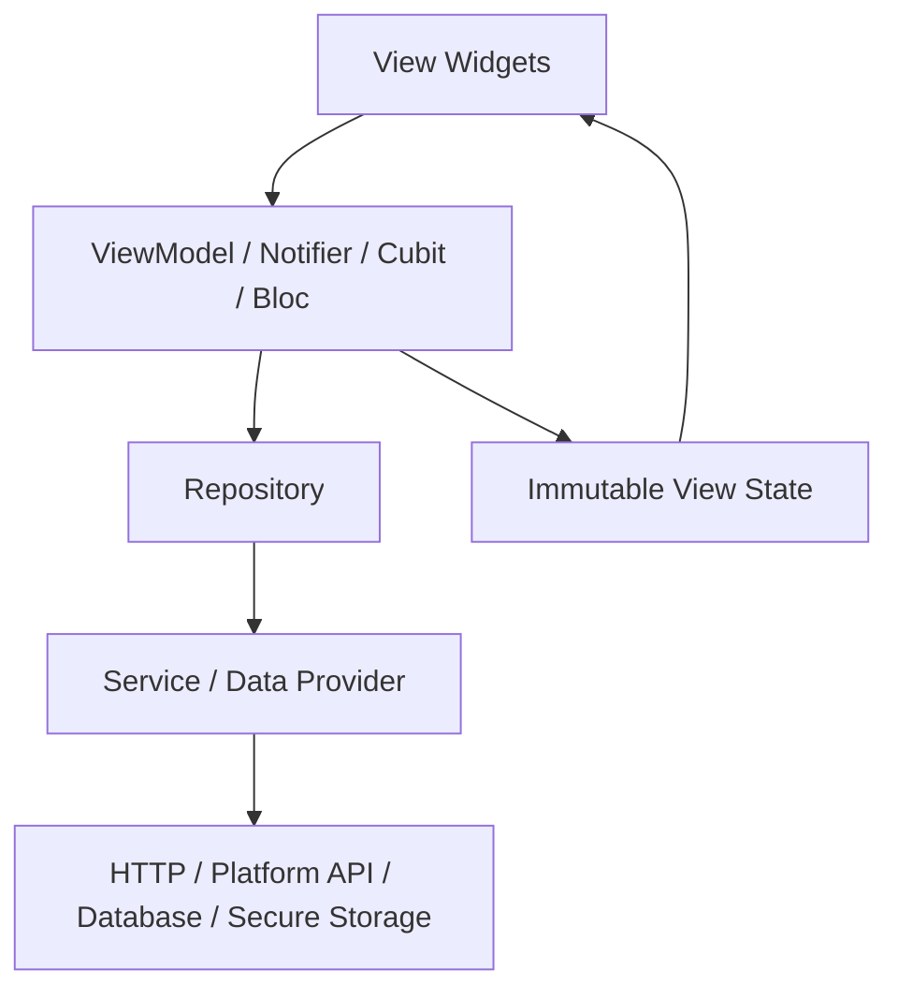
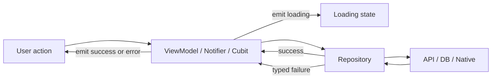

# Architecture And State

Use this reference when choosing Flutter app architecture, state management, feature boundaries, repository/service placement, or app-shell/game-shell ownership.

## Production App Baseline

### Executive summary

This reference is optimized for teams making architecture decisions and conducting code reviews for production Flutter apps on iOS and Android. The primary goals are explicit: **readability**, **testability**, **performance on iOS and Android**, **maintainability**, and **scalability**. Flutter’s current official architecture guidance centers on a scalable app structure with clear layers; its case study specifically uses **repositories and services in the data layer** and **MVVM in the UI layer**. Dart’s language and tooling reinforce that direction with sound null safety, strong static analysis, recommended lint sets, class modifiers, and package/workspace conventions.

If you want one default recommendation for most serious product teams, use this:

* **Feature-first, layered architecture**
* **Small, pure widgets**
* **Immutable view state**
* **Sound null-safety everywhere**
* **Typed public APIs**
* **Repositories for IO and data orchestration**
* **A view-model/notifier/bloc per feature boundary**
* **Heavy emphasis on unit and widget tests, with selective integration and golden tests**
* **`flutter_lints` plus a few extra lints**
* **Profile on real devices in profile mode, not debug mode**
* **Platform security primitives, not “security by obfuscation”**

Practical recommendation by team/app size is straightforward. For a **small app**, built-in/local state plus a thin repository layer is enough. For a **medium-to-large app**, the best default is the official Flutter-style layered architecture with a feature-local UI model, backed by repositories/services. For teams that strongly value explicit event/state flows, auditing, and code review consistency, **Bloc/Cubit** is a good fit. For teams that want ergonomic dependency management, testable containers, and flexible composition with less widget-tree coupling, **Riverpod** is an excellent fit. These are architectural trade-offs, not universal truths. Flutter itself explicitly says architecture recommendations are recommendations, not steadfast rules, and should be adapted to your app’s needs.

When app details are unspecified, identify: app domain, team size, whether the app is pure Flutter or add-to-app, whether plugin/native-heavy features dominate, and whether compliance constraints apply. Where those details change the recommendation materially, this reference says so explicitly. Without that context, the guidance below assumes a **production mobile app** intended to scale across multiple features and contributors.

### Decision principles

Beautiful Flutter code is not “clever Flutter code.” It is code that is boring to review, easy to change, cheap to test, hard to misuse, and predictable under load. Flutter’s own architecture guide frames architecture as the way you **structure, organize, and design** an app so it can scale as project requirements and team size grow. Dart’s style guidance says consistent formatting, naming, and ordering materially improve readability and shared understanding across teams.

A useful decision rubric is:

| Goal | What “good” looks like | What usually breaks it |
|---|---|---|
| Readability | Small files, named parameters, typed public APIs, consistent imports, minimal indirection | Layer explosion, clever abstractions, ambiguous names, dynamic-heavy APIs |
| Testability | UI separated from IO, deterministic state transitions, pure builders, easy mocking/faking | Business logic in widgets, hidden globals, side effects in `build`, wide `setState` |
| Performance | Minimal unnecessary rebuilds, lazy lists, isolate offload for heavy compute, profile-mode validation on devices | Huge widget subtrees rebuilding, `Opacity`/`saveLayer` abuse, synchronous decode/parse on main isolate |
| Maintainability | Feature boundaries, repository wrappers for external services, stable public package APIs, strong linting | Package `src/` imports, dependency overrides lingering in main, mutable shared state |
| Scalability | Monorepo/workspace or package boundaries when needed, feature ownership, modular CI | Layer-first sprawl, no ownership model, too many transitive dependencies |

The core API-design bias should be toward **explicitness**. Flutter’s internal design notes emphasize that named arguments keep constructor-heavy UI code understandable, and Dart’s Effective Dart guidance emphasizes typed public APIs, deliberate naming, and class modifiers such as `final`, `sealed`, and `base` to communicate intended usage.

That leads to a practical standard for reviews: every abstraction must justify itself in one of three ways. It must either reduce cognitive load, reduce defect rate, or reduce change cost. If it does none of those, delete it.

## Layered Architecture And State Management

### Architecture and state management

Flutter’s most concrete official app-architecture example is a layered structure where the **UI layer** is a **View + ViewModel** pair and the **data layer** uses **repositories and services**. In the official case study, each feature’s UI has a one-to-one relationship between a view and a view model, and the data layer separates responsibilities by repository type.



#### Architecture options

| Architecture | Core idea | Strengths | Weaknesses | Best fit |
|---|---|---|---|---|
| Official Flutter layered app architecture | View + ViewModel in UI; repositories/services in data layer | Good separation, scalable, testable, aligns with official guidance | Slightly more ceremony than a tiny app | Default for most production apps |
| Minimal layered architecture | Widgets + local state + one repository layer | Low ceremony, fast to build, easy to understand | Can sprawl once async flows and feature count grow | Small apps, prototypes, internal tools |
| Bloc layered architecture | Presentation, business logic, data, repository/data provider split | Explicit state transitions, good reviewability, strong team conventions | More boilerplate, can over-model simple flows | Regulated flows, complex event/state logic, larger teams |
| Domain-heavy “clean” variant | Official layered architecture plus explicit use-case/domain policy layer | Strong isolation of business rules and easier backend/UI replacement | Extra indirection; often overkill unless domain complexity is high | Large apps with rich business workflows |

Recommended default is to start with **feature-first official layered architecture** and add a separate domain/use-case layer only when business rules become both non-trivial and reused across multiple flows. Most teams add that layer too early.

#### State-management options

Flutter’s own state-management overview positions `setState` as the low-level approach for widget-specific ephemeral state, and `ValueNotifier`/`InheritedNotifier` as a purely Flutter-native option for notifying the UI of state changes. The official simple state-management guide uses `provider` and `ChangeNotifier`, noting that a single `ChangeNotifier` works for very simple apps, while more complex apps typically use multiple models. Riverpod’s official docs emphasize container-based state storage and code generation support for annotated functions/classes. Bloc’s docs emphasize a layered architecture and pure builder functions.

| State manager | Pros | Cons | Review stance | Best fit |
|---|---|---|---|---|
| `setState` | Zero dependency, ideal for ephemeral/local UI | Easy to overuse; poor for shared async state | Good only for local widget state | Toggles, form field UI, transient interaction state |
| `ValueNotifier` + `InheritedNotifier` | Small API surface, Flutter-native, light ceremony | Manual composition gets awkward as app grows | Good for focused, simple shared state | Lean apps or narrow state slices |
| `Provider` + `ChangeNotifier` | Familiar, simple, officially demonstrated in Flutter guides | Mutable-notifier style can encourage coarse updates | Fine for small/medium apps if discipline is strong | Teams optimizing for simplicity |
| Riverpod | Container-based state, less widget-tree coupling, good pure-Dart testability, strong async ergonomics | Not an official Flutter package; team must learn its model | Excellent default for many modern teams | Medium/large apps, test-heavy teams |
| Cubit / Bloc | Explicit inputs/outputs, review-friendly, strong conventions, rebuild controls like `buildWhen`/`BlocSelector` | More boilerplate than Riverpod or local state | Excellent where state transitions are part of design review | Complex workflows, auditability, multi-dev teams |

Default ranking:

* **Local/ephemeral UI state:** `setState`
* **Simple cross-widget shared state:** `ValueNotifier` or `Provider`
* **Most medium/large product apps:** **Riverpod** or **Cubit/Bloc**
* **Avoid architecture-by-fashion:** if the state graph is simple, do not introduce orchestration just to feel “enterprise”

#### A practical decision rule

Use **Bloc/Cubit** when you want explicit, reviewable event/state transitions and stricter conventions. Use **Riverpod** when you want lighter composition, strong testability, and less coupling to the widget tree. Use **Provider/ChangeNotifier** when the team values minimal ceremony and the state model is still modest. This is not a performance ranking. None of these should be chosen because of presumed micro-benchmark superiority; the real performance wins usually come from rebuild granularity, lazy rendering, avoiding expensive paint/layout work, and not blocking the UI isolate.



## Runtime-Oriented Architecture Summary

### Executive summary

Elegant Flutter code comes from respecting Flutter’s actual execution model, not from chasing a particular package or pattern. Flutter rebuilds widgets aggressively, updates `State` only when widget `runtimeType` and `key` still match, and renders frames by coordinating work between the UI isolate and the raster thread. That means the highest-leverage rules are structural: keep `build()` pure, make identity stable, isolate mutable state, scope rebuilds narrowly, avoid per-frame allocation churn, and choose architectures that separate high-frequency simulation from low-frequency UI orchestration. Flutter’s own architecture guidance favors layered design and unidirectional data flow for scalable apps, while the framework docs emphasize small widgets, `const`, pure builders, and caching unchanged subtrees.

For most non-game mobile apps, the most reviewable default is a layered architecture with a UI layer, optional domain logic layer, and data layer, combined with unidirectional flow and a state-management tool that makes dependencies explicit. For most games, a hybrid architecture is stronger: use Flutter widgets for shell, menus, HUD, purchases, auth, and platform integration; use a real game loop and component or ECS model for the world simulation; then bridge only coarse-grained state between them. Running the simulation by calling `setState()` every tick is architecturally wrong for Flutter and gets worse as entity count rises. Flame exists largely to solve that class of problem with `FlameGame`, world/camera separation, overlays, physics bridges, and game-specific lifecycle hooks.

The most common review failures in mature Flutter codebases are predictable: unstable keys causing remounts and animation replays; futures, streams, or subscriptions created in `build()`; giant `ChangeNotifier`s or top-level `setState()` that fan out into rebuild storms; implicit globals that make state movement invisible in review; animation controllers that are recreated or not disposed; platform views dropped into animation-heavy scenes without understanding composition trade-offs; and game loops that allocate work every frame instead of reusing objects and buffers. Flutter’s docs and engine material make clear that frame time, `saveLayer()`, opacity, clipping, intrinsic layout passes, image decoding, and isolate misuse are all recurrent sources of jank.

If this reference is used for architecture and code review, the core decision rule should be simple: **optimize for explicit identity, explicit ownership, explicit lifecycle, and explicit data flow**. Beautiful Flutter code is code whose runtime behavior is obvious from the diff. That standard scales across iOS, Android, apps, and games.

## State Management Patterns And Tradeoffs

### State management patterns and when each one fits

The right question is not “which state management library is best.” The right question is “what unit of state changes, who owns it, how often does it change, and how visible is that flow in review?” Flutter’s architecture guide favors explicit dependencies, layered boundaries, and UDF; different state tools simply implement those goals with different trade-offs.

The comparison below is **author synthesis** based on the official docs for Flutter architecture, Provider, Riverpod, Bloc, Redux, GetX, and Flutter’s `Listenable`/`Inherited*` primitives.

| Pattern | Strengths | Weaknesses | Best fit | Code review risk |
|---|---|---|---|---|
| `setState` + local `State` | Minimal overhead, obvious ownership | Easy to over-scope rebuilds, poor for cross-feature flows | Ephemeral view state | Broad rebuilds |
| `ValueNotifier` / `ListenableBuilder` | Very cheap and explicit for localized hot state | Manual composition gets messy at scale | Small hot paths, controls, HUD counters | Forgotten disposal or overuse |
| `ChangeNotifier` + Provider | Familiar, easy DI, simple for CRUD apps | Notifications are O(N); monolith notifiers become opaque | Medium apps, app shell DI | Giant notifier anti-pattern |
| Riverpod | Explicit dependencies, safer reads, strong async model, multiple providers of same type | More conceptual surface area | Medium-to-large apps, modular features | Provider sprawl if uncurated |
| BLoC / Cubit | Predictable event/state flow, pure builders, strong tests | Boilerplate and ceremony | Large teams, review-heavy regulated domains | Over-modeling trivial state |
| Redux | Single store, middleware, replayability, rigid predictability | Boilerplate, global coupling, heavy indirection | Auditability, event logs, complex cross-feature flows | Reducer bloat |
| GetX | Fast to ship, bundled state/DI/routing, low ceremony | Implicit globals and mixed concerns can hide ownership | Small teams, prototypes, bounded apps | Hidden coupling |
| Custom game controller / ECS | Best for high-frequency simulation, entity isolation, deterministic loops | Higher up-front design cost | Games and visual simulation | Reinventing infrastructure badly |

A few rules hold up well in review.

Provider is a very good dependency-injection default in ordinary apps because it formalizes ownership and disposal at the widget-tree boundary, and Flutter’s own architecture case study recommends it for DI. But the Provider docs are explicit about one crucial footgun: use the default constructor to create objects, and do **not** use `.value` to create a new object, because that can create undesired lifecycle behavior. Also remember that `ChangeNotifier` listener dispatch is O(N), which makes “one app-scoped mega-notifier” a bad fit for high-frequency updates and most games.

Riverpod’s strongest advantage is that it moves dependency access and lifecycle into a more explicit system than classic Provider, especially for asynchronous state. Its docs emphasize safer reads and better loading/error handling, and current Riverpod guidance prefers `Notifier` and `AsyncNotifier` over the older `StateNotifier` approach for new code. For code review, that usually means fewer implicit dependency assumptions and cleaner async state handling than ad hoc `FutureBuilder` trees.

BLoC remains strong when a team needs strict event/state boundaries, consistent testability, and reviewers who want to reason about side effects explicitly. The official architecture docs describe the familiar layered Presentation / Business Logic / Data split, and `BlocBuilder`’s builder is explicitly intended to be a pure function that can run many times. The main cost is ceremony. If a feature is truly simple, BLoC can become a verbosity tax.

Redux is still defensible where replayability, single-source event history, or middleware discipline matter more than terseness. The Dart Redux docs describe a typed state ecosystem with middleware/devtools support, and `flutter_redux` provides the widget bridge. The trade-off is predictable: global coupling and boilerplate. It is rarely the best default for a greenfield mobile app in 2026 unless the team explicitly wants Redux’s constraints.

GetX deserves a fair reading. Its own docs position it as an “extra-light” solution that combines state, DI, and routing and emphasizes performance and organization without using Streams or `ChangeNotifier`. That is exactly why some teams like it. The reason many large-team reviewers push back is not that it cannot work; it is that the same convenience can blur boundaries and make dependency flow less explicit in diffs. In small bounded codebases, that may be a fine trade. In large codebases, it usually increases review risk. That is a judgment call, not a framework law.

For games, the best pattern is usually hybrid. Use Riverpod, Provider, or BLoC for shell state, account state, matchmaking, inventory metadata, economy configuration, and menus. Use a game-world controller, Flame component tree, or ECS for simulation. Flame explicitly supports bridge packages for Riverpod, Bloc, isolates, audio, and ECS via Oxygen, which is a strong signal about where those boundaries naturally belong.

A useful code-review smell table is this one:

| Smell | Why it is bad | Better shape |
|---|---|---|
| App-wide `setState()` for business state | Rebuild scope is invisible and broad | Feature controller or provider boundary |
| One giant `ChangeNotifier` | O(N) notifications and opaque coupling | Multiple small notifiers or Riverpod/BLoC |
| Package chosen per feature | Fragmented mental model | One dominant app pattern, justified exceptions |
| High-frequency game state in widget tree | Rebuild storm at tick rate | Simulation loop + coarse UI projection |
| Stateful dependency locator | Ownership unclear | DI through provider scope or explicit constructor injection |

A representative Provider refactor:

```dart
// Bad: creates a new object using .value, hiding lifecycle mistakes.
Widget build(BuildContext context) {
  return ChangeNotifierProvider<PlayerController>.value(
    value: PlayerController(),
    child: const PlayerView(),
  );
}

// Good: provider owns creation and disposal.
Widget build(BuildContext context) {
  return ChangeNotifierProvider(
    create: (_) => PlayerController(),
    child: const PlayerView(),
  );
}
```

That exact `.value` misuse is called out in Provider’s own docs.
