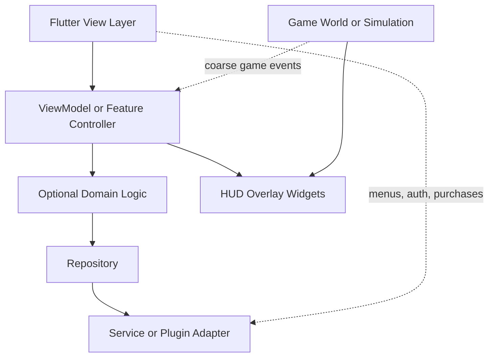

# Dart Style, Project Structure, And APIs

Use this reference when shaping Dart code style, project layout, package boundaries, lints, dependency policy, widget composition, public APIs, immutable state, null safety, and error boundaries.

## Flutter And Dart Style Principles

### Core principles and idiomatic Dart and Flutter style

Flutter’s own architecture guidance recommends intentional architecture, layering, and unidirectional data flow. In the Flutter team’s app architecture guide, the UI layer displays state and handles user interaction, the optional logic layer encapsulates client-side business logic, and the data layer owns repository/service interactions; the update loop runs from UI events back to logic/data and then returns new state to the UI. The same guide strongly recommends treating these as recommendations rather than dogma, which is the right tone for reviews: architecture should be chosen deliberately, then applied consistently.

The idiomatic Dart baseline is equally clear. Use `dart format`, follow Effective Dart’s naming and API-design conventions, write user-centric doc comments, and enforce lints through `flutter_lints` and customized analysis options. If a team wants stricter code review standards, start from `flutter_lints`, then add a narrow set of high-value rules that catch real runtime or maintainability issues rather than cargo-cult style preferences. One of the most useful stricter rules is `avoid_dynamic_calls`, because dynamic dispatch can carry both runtime and code-size penalties.

A practical `analysis_options.yaml` baseline looks like this:

```yaml
include: package:flutter_lints/flutter.yaml

linter:
  rules:
    avoid_dynamic_calls: true
    unnecessary_async: true
    prefer_final_locals: true
    use_super_parameters: true
```

That is not “the right” universal ruleset. The correct ruleset is the smallest set that makes bad code hard to land and good code easy to write. Dart explicitly supports customizing static analysis for that reason.

In Flutter UI code, the framework’s own performance guidance and architecture guidance converge on the same style: prefer many small widgets to giant build methods, use `const` constructors whenever possible, and prefer reusable widget classes over ad hoc helper functions when building pieces of UI. Flutter can reuse `const` widget instances and short-circuit substantial rebuild work; smaller widgets also lower local complexity and make review diffs narrower and more legible.

This is the basic shape worth standardizing on:

```dart
class ProfileHeader extends StatelessWidget {
  const ProfileHeader({
    required this.name,
    required this.avatar,
    super.key,
  });

  final String name;
  final ImageProvider avatar;

  @override
  Widget build(BuildContext context) {
    return Row(
      children: [
        CircleAvatar(backgroundImage: avatar),
        const SizedBox(width: 12),
        Expanded(
          child: Text(
            name,
            maxLines: 1,
            overflow: TextOverflow.ellipsis,
          ),
        ),
      ],
    );
  }
}
```

The bad version is the common “one stateful page with a 400-line `build()` plus local helper methods and incidental mutable fields.” That style is not just ugly; it makes rebuild boundaries, lifecycles, and ownership hard to see.

A second idiomatic rule is to design widget trees around **stable identity**. Flutter updates an existing element only when the new widget at that location has the same `runtimeType` and key; otherwise, the old element is unmounted and a new one is inflated. That single rule explains most remount bugs, focus loss, controller resets, hero glitches, and animation replays. In reviews, every introduced key should be read as a claim about identity, and every changed key as a claim about remounting.

A third rule is to push mutable state to the leaves. Flutter’s `StatefulWidget` docs explicitly call out two performance-friendly patterns: widgets that allocate resources once and then do not frequently rebuild, and widgets that push stateful work down into small leaves while caching or reusing stable subtrees. If a subtree does not change, cache the widget instance or extract the changing fragment into a smaller stateful boundary that accepts a stable `child`. That is one of the cleanest ways to reduce rebuild cost without reaching immediately for an external state package.

The architectural pattern below is the best default for most large apps, and the best shell around most games:



This combines Flutter’s recommended layering and UDF with the game-specific requirement that the world simulation normally should not be driven by widget rebuilds.

## Code Organization And APIs

### Code organization and APIs

Dart package-layout conventions matter more in large codebases than most teams realize. Everything inside `lib/` is publicly importable by other packages; internal implementation files belong under `lib/src/`, and other packages should never import another package’s `lib/src` directly because it is not part of the stable public API. Pub workspaces allow monorepo-style shared resolution across tightly related packages, reducing analysis memory cost, but also forcing dependency conflicts to surface early.

#### Structure options

A good default single-package structure for a production app:

```text
lib/
  src/
    app/
      app.dart
      router.dart
      theme/
    core/
      error/
      logging/
      networking/
      utils/
      widgets/
    features/
      auth/
        data/
        presentation/
      profile/
        data/
        presentation/
      checkout/
        data/
        presentation/
  main.dart
```

This structure keeps ownership local to features while preserving shared cross-cutting concerns in `core`. It also respects Dart’s package-layout rules by keeping internal implementation in `lib/src`. The “feature-first versus layer-first” trade-off is widely discussed in influential community guidance; feature-first tends to localize ownership and reduce cross-feature merge pain, while layer-first often looks tidy early and becomes harder to navigate as the app grows. That trade-off is a reasoned inference, not an official Flutter rule.

For larger organizations, use a workspace:

```text
/
  pubspec.yaml          # workspace root
  apps/
    mobile_app/
  packages/
    design_system/
    networking/
    auth_client/
    feature_profile/
    feature_checkout/
```

Use this only when package boundaries are real: separate ownership, release cadence, design system reuse, or add-to-app/native interop boundaries. Otherwise, a monorepo can become complexity theater. Pub workspaces are specifically meant for tightly related packages sharing a single dependency resolution.

#### Dependency management

Dependency policy should be conservative. Pub dependencies are declared in `pubspec`, and you should list **only immediate dependencies**. For application packages, Dart recommends committing `pubspec.lock` so changes to transitive dependencies stay explicit. In CI and production-oriented retrieval, use `dart pub get --enforce-lockfile` so dependency content and versions must match the lockfile; otherwise, retrieval fails instead of silently drifting. `dependency_overrides` are supported for temporary development use, but they should not become permanent architecture.

| Dependency practice | Recommendation | Why |
|---|---|---|
| Lockfiles | Commit `pubspec.lock` for apps | Makes transitive dependency changes explicit |
| CI retrieval | Use `dart pub get --enforce-lockfile` | Prevents deploying untested dependency resolution/content |
| Version hygiene | Regularly run `dart pub outdated` | See what is stale before large surprise upgrades |
| Dependency scope | Depend only on immediate packages you use directly | Reduces accidental coupling and clarifies ownership |
| Overrides | Use `dependency_overrides` only temporarily | Overrides are for development, not architectural state |

#### API design and widget composition

Flutter’s own design notes explicitly favor **named arguments** because constructor-heavy UI code becomes much easier to read when the semantic meaning of each argument is visible. Effective Dart recommends type-annotated public APIs, clear naming, and class modifiers that enforce extension/implementation intent.

That yields a concrete code-review standard:

* Public functions, classes, and exported fields should be fully typed.
* If a method primarily **returns a value**, name it like the value returned, not like work performed.
* If a method primarily **causes a side effect**, use an imperative verb.
* Use `sealed`, `final`, or `interface` when you mean it.
* Prefer constructors and state objects that are immutable and `const` where possible.

A minimal `analysis_options.yaml` baseline that aligns with official guidance:

```yaml
include: package:flutter_lints/flutter.yaml

linter:
  rules:
    type_annotate_public_apis: true
    implementation_imports: true
    avoid_relative_lib_imports: true
    prefer_const_constructors: true
    prefer_const_constructors_in_immutables: true
    prefer_const_literals_to_create_immutables: true
    curly_braces_in_flow_control_structures: true
    directives_ordering: true
```

This builds on `flutter_lints`, which is published by `flutter.dev` and is the recommended lint set for Flutter apps, packages, and plugins. The additional rules above map directly to official Dart guidance on typed public APIs, private package internals, const usage, import hygiene, and flow-control clarity.

Widgets themselves should stay small and compositional. Flutter is designed around aggressive composition and diffing widget descriptions into minimal render-tree changes, so “too many small widgets” is usually the wrong fear. The real concern is whether builders are pure, subtrees are needlessly rebuilt, or expensive work is performed on the UI thread. Bloc’s docs state explicitly that a builder should be a **pure function** that returns UI for the current state. Flutter’s performance docs likewise recommend passing non-changing subtrees as the `child` of `AnimatedBuilder` instead of rebuilding them every tick.

#### Immutability, null-safety, and error boundaries

Dart enforces sound null safety: types are non-nullable by default, and non-nullable variables must be initialized with non-null values. Immutable objects in Dart should have final fields, and official lints encourage `const` constructors and const literals when constructing immutable objects.

In practice, that means:

* Treat UI state objects as immutable snapshots.
* Avoid using `late` as a routine escape hatch from proper initialization.
* Return unmodifiable views or copies for collections.
* Use `const` constructors and literals aggressively where semantics allow.
* Model nullable data intentionally at boundaries, not lazily through the whole app.

On errors, Flutter’s internals are deliberately aggressive in debug builds: constructor arguments are spot-checked, asserts are widely used, and inconsistencies trigger immediate exceptions. For production code, the practical extension of that philosophy is to fail early in lower layers, convert raw exceptions into typed failures at repository boundaries, and let the UI render explicit loading/error/success states instead of burying failures in generic `catch` blocks. Flutter-specific assertion/contract failures are represented by `FlutterError`. The exact shape of a domain-failure hierarchy is app-specific and therefore unspecified by Flutter.
