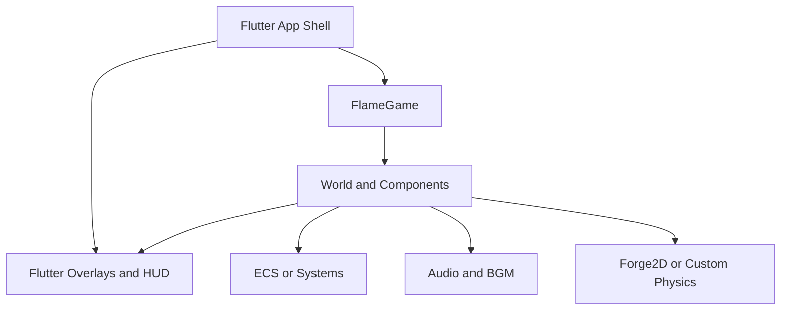

# Games, Flame, Audio, And Physics

Use this reference when building or reviewing Flutter games, Flame game loops, game-world/HUD boundaries, overlays, ECS/components, per-frame allocation, Flame lifecycle, input, audio, and physics decisions.

## Games-Focused Architecture, Audio, Physics, And Loop Design

### Games-focused architecture, audio, physics, and loop design

Flutter can build games, but the architecture that works best for transaction forms or feed screens is not the architecture that works best for a 60–120 fps simulation. The Flutter Casual Games Toolkit exists specifically to accelerate mobile game development, and the Flame ecosystem exists because games need a central game loop, component hierarchies, world/camera abstractions, overlays, physics bridges, and audio helpers beyond ordinary widget patterns.

#### The architecture that works well for games

Use a hybrid model:

- **Flutter shell**: lifecycle, routing, menus, HUD widgets, monetization, auth, social, settings, purchases.
- **Game world**: `FlameGame`, custom components, or ECS for entities, simulation, camera, collisions, and effects.
- **Bridge state**: publish coarse snapshots or events from the world into the shell, not per-frame entity state.

That architecture keeps the widget tree at human interaction frequency while the world updates at frame frequency. Flame’s docs explicitly describe `FlameGame` as the central object that owns the game loop and as the root of the component tree; `CameraComponent` and `World` formalize the view/model split for the simulation itself.

A practical game architecture diagram:



#### Game-specific anti-patterns

The Flame performance docs warn about the exact issue game developers repeatedly rediscover in Flutter: if a frame allocates new objects every update, then at 30, 60, or 120 fps you create allocation churn at that same rate. That churn turns into GC pressure, stutter, and noisy profiles. Object pooling is not universally necessary in Flutter UI code, but it becomes defensible in game hot paths.

Other recurrent game anti-patterns are these:

| Anti-pattern | Consequence | Better pattern |
|---|---|---|
| World state in widget tree | Rebuild storm at tick rate | Keep simulation in game loop |
| Add/remove components just to hide them | Lifecycle churn and async races | Use visibility or overlays deliberately |
| Per-frame object creation | GC pressure and hitches | Reuse vectors, particles, buffers |
| Await inside update loop | Frame pacing collapse | Queue results, apply next frame |
| Isolate every small task | Overhead dominates | Reserve isolates for real heavy work |
| Global `setState()` HUD updates every frame | Shell jank | Publish throttled/coarse HUD state |

Flame’s component docs add an especially important nuance: removing and re-adding a component triggers lifecycle steps like `onRemove` and `onMount`, removal is asynchronous, and you may need to await the `removed` future before re-adding in quick succession. If your intent is only visibility, `HasVisibility` may be better—but note that invisible components still update, receive input, and participate in collision logic unless you explicitly change those behaviors too. That is a subtle but crucial review item.

Similarly, Flame’s game lifecycle distinguishes `onLoad`, `onMount`, and `onRemove`; `onLoad` runs only the first time, while `onMount` runs each time an object is mounted to a parent. That is the Flame analogue of Flutter’s remount rules and should drive asset loading, controller creation, and cleanup placement inside the world layer.

#### Input, audio, and physics in games

For input, prefer component-level input over one giant game-level gesture handler. Flame’s input docs explicitly say that gesture inputs attached directly to the game class are available, but most of the time you want to detect input on components instead, using systems such as `TapCallbacks`, `DragCallbacks`, and `KeyboardHandler`. That keeps responsibility local to the entity or control that owns the behavior.

For audio, split the problem. Short repeated sound effects benefit from caching or pooling. Flame’s audio docs and `AudioPool` helpers are designed for game SFX, while `Bgm` exists to manage looping music with lifecycle-aware pausing and resuming. For richer app-style playback, sequencing, and gapless audio outside the game loop, a feature-rich player such as `just_audio` is generally a better fit than game-specific wrappers.

For physics, use Flutter’s animation physics when you want UI-feel realism such as spring cards, fling gestures, or elastic panels. Use Forge2D when you need actual rigid-body simulation, joints, and world-step behavior. Do not pay a full physics-engine cost for simple kinematics, parallax, or tweened arcade motion. The Forge2D docs make clear that it is a Box2D-family physics engine with specialized `Forge2DGame`, `BodyComponent`s, and joint support; that is overkill for many casual games.

A healthy rule for game code review is this: **if a behavior can be expressed as pure kinematics, timers, tweens, or deterministic systems, do not reach for global widget state or a full physics engine first.**

#### A concrete game refactor

```dart
// Bad: widget tree is the game loop.
class BadHudAndGame extends StatefulWidget {
  const BadHudAndGame({super.key});

  @override
  State<BadHudAndGame> createState() => _BadHudAndGameState();
}

class _BadHudAndGameState extends State<BadHudAndGame> {
  int score = 0;

  @override
  void initState() {
    super.initState();
    ticker.start(); // imagine this calls setState() 60x/sec
  }

  void onTick() {
    setState(() {
      score++;
      // also mutates enemy positions, bullets, particles, collisions...
    });
  }

  @override
  Widget build(BuildContext context) {
    return Stack(
      children: [
        CustomPaint(painter: MyPainter(/* entire world state */)),
        Text('Score: $score'),
      ],
    );
  }
}
```

```dart
// Better: game loop owns simulation, Flutter owns shell/HUD.
class MyGame extends FlameGame {
  final ValueNotifier<int> score = ValueNotifier<int>(0);

  @override
  void update(double dt) {
    super.update(dt);
    // mutate world here
    // only publish coarse HUD changes when values actually change
  }

  @override
  void onRemove() {
    score.dispose();
    super.onRemove();
  }
}

class GamePage extends StatelessWidget {
  const GamePage({required this.game, super.key});
  final MyGame game;

  @override
  Widget build(BuildContext context) {
    return Stack(
      children: [
        GameWidget(game: game),
        ValueListenableBuilder<int>(
          valueListenable: game.score,
          builder: (context, score, _) => Text('Score: $score'),
        ),
      ],
    );
  }
}
```

This is exactly the sort of boundary that keeps both the game loop and the Flutter shell reviewable. Flame’s overlay system is also a good fit for menus and temporary UI above the world.
