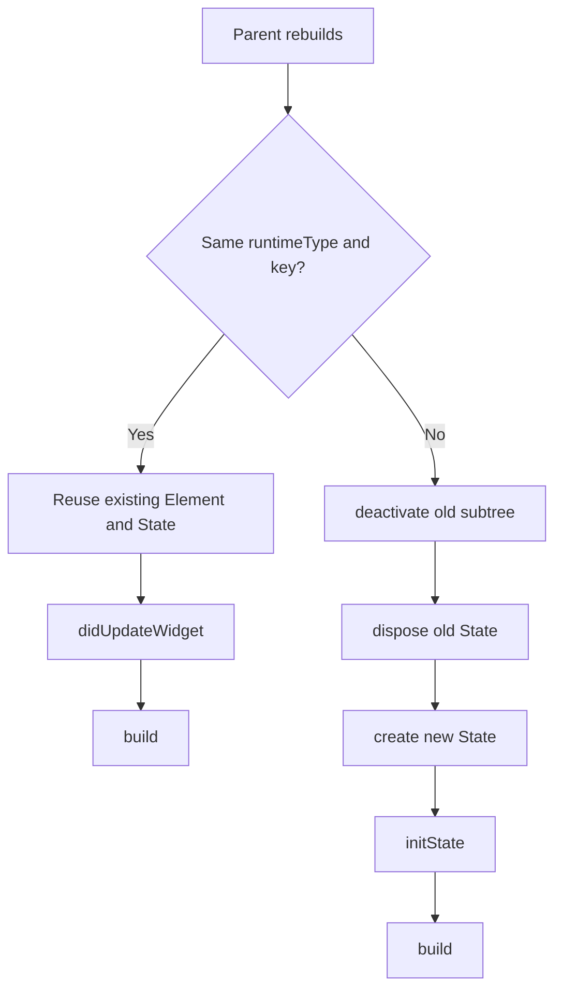

# Lifecycle, Identity, And Async Ownership

Use this reference when diagnosing remounts, key churn, animation replay, lifecycle placement, async restart bugs, `setState` misuse, mounted guards, ticker behavior, or lifecycle regression tests.

## Lifecycle, Remounts, Dispose Behavior, And Animation Stability

### Lifecycle, remounts, dispose behavior, and animation stability

Most Flutter lifecycle bugs reduce to one rule: **state is preserved only when identity is preserved**. When a parent rebuilds and places a new widget at the same location with the same `runtimeType` and key, the framework updates the existing element and calls `didUpdateWidget()` on its `State`. If the type or key changes, Flutter unmounts the old element and inflates a new one. After `dispose()`, the `State` is terminal and cannot be remounted.

That yields the lifecycle flow reviewers should have in mind:



This is why unstable `ValueKey`s, recreated `GlobalKey`s, `UniqueKey()` in `build()`, or list item keys tied to index rather than stable identity are so destructive: they request remounts. Flutter even provides debug instrumentation for diagnosing `GlobalKey` lifecycle behavior via `debugPrintGlobalKeyedWidgetLifecycle`.

A `build()` method can run after `initState`, after `didUpdateWidget`, after `setState`, after inherited dependency changes, and even after deactivation/reinsertion; the docs explicitly warn that `build()` can conceptually run every frame and must have no side effects beyond building widgets. That means the entire class of “start animation in build,” “subscribe in build,” “create stream in build,” and “fire async work in build” is unidiomatic unless the work is carefully memoized elsewhere.

#### The stable places for side effects

Use `initState()` for one-time resource creation. Use `didUpdateWidget()` to respond when widget configuration changes but identity stays the same. Use `didChangeDependencies()` for work that depends on inherited widgets. Use `dispose()` for cleanup. Flutter’s `AnimationController` docs and `State` docs are very explicit on this pattern, and the `AnimationController` sample itself updates controller configuration in `didUpdateWidget()`.

```dart
class Pulse extends StatefulWidget {
  const Pulse({
    required this.duration,
    required this.child,
    super.key,
  });

  final Duration duration;
  final Widget child;

  @override
  State<Pulse> createState() => _PulseState();
}

class _PulseState extends State<Pulse>
    with SingleTickerProviderStateMixin {
  late final AnimationController _controller = AnimationController(
    vsync: this,
    duration: widget.duration,
  )..repeat(reverse: true);

  @override
  void didUpdateWidget(covariant Pulse oldWidget) {
    super.didUpdateWidget(oldWidget);
    if (oldWidget.duration != widget.duration) {
      _controller.duration = widget.duration;
    }
  }

  @override
  void dispose() {
    _controller.dispose();
    super.dispose();
  }

  @override
  Widget build(BuildContext context) {
    return ScaleTransition(
      scale: Tween(begin: 0.98, end: 1.02).animate(_controller),
      child: widget.child,
    );
  }
}
```

Use `SingleTickerProviderStateMixin` when a state owns one controller over its lifetime, and `TickerProviderStateMixin` when one state owns multiple controllers. Flutter’s docs explicitly say the single-ticker mixin is more efficient for that common one-controller case, while the multi-ticker mixin is more efficient than splitting multiple controllers across multiple states.

#### Why animations replay when you did not ask them to

For implicit animations, the framework says `ImplicitlyAnimatedWidget`s **do not animate on first insertion**; they animate when rebuilt with different values. So when an animation “replays on initial show,” one of two things is usually happening: either the target value is changing after insertion, or the widget was actually remounted, causing a new initial insertion. That is the diagnostic lens to use in code review.

Common causes of unwanted replays are:

| Cause | Mechanism | Typical fix |
|---|---|---|
| Changing key | Forces remount | Keep key stable or remove it |
| Recreating `AnimationController` | New state object or explicit rebuild logic | Create once in `initState` |
| Starting animation in `build()` | Replays every rebuild | Trigger from lifecycle/event boundary |
| Recreating future/stream/controller in builder | Restarts async work and dependent animation | Create earlier and reuse |
| `AnimatedSwitcher` child identity changes accidentally | Switcher sees a different child | Make keys reflect semantic identity only |

`AnimatedSwitcher` and `TweenAnimationBuilder` deserve specific review attention. `AnimatedSwitcher` compares child identity and will animate when the child changes; `TweenAnimationBuilder` takes ownership of the tween and mutates it, so storing and reusing the same tween instance outside the widget is bad form.

#### Bad and good refactors

```dart
// Bad: accidental remount on every selection change because the key encodes
// something that should not define widget identity.
class BadAvatar extends StatelessWidget {
  const BadAvatar({required this.selected, super.key});
  final bool selected;

  @override
  Widget build(BuildContext context) {
    return AnimatedContainer(
      key: ValueKey(selected),
      duration: const Duration(milliseconds: 250),
      padding: EdgeInsets.all(selected ? 8 : 0),
      child: const CircleAvatar(),
    );
  }
}

// Good: no key, or a stable key tied to actual entity identity.
class GoodAvatar extends StatelessWidget {
  const GoodAvatar({required this.selected, required this.userId, super.key});
  final bool selected;
  final String userId;

  @override
  Widget build(BuildContext context) {
    return AnimatedContainer(
      key: ValueKey(userId),
      duration: const Duration(milliseconds: 250),
      padding: EdgeInsets.all(selected ? 8 : 0),
      child: const CircleAvatar(),
    );
  }
}
```

```dart
// Bad: async work recreated in build, so parent rebuilds restart the future.
class BadScreen extends StatelessWidget {
  const BadScreen({super.key});

  @override
  Widget build(BuildContext context) {
    return FutureBuilder<User>(
      future: repository.fetchUser(), // restarted repeatedly
      builder: (context, snapshot) => Text('${snapshot.data}'),
    );
  }
}

// Good: create once and reuse while identity is stable.
class GoodScreen extends StatefulWidget {
  const GoodScreen({super.key});

  @override
  State<GoodScreen> createState() => _GoodScreenState();
}

class _GoodScreenState extends State<GoodScreen> {
  late final Future<User> _future = repository.fetchUser();

  @override
  Widget build(BuildContext context) {
    return FutureBuilder<User>(
      future: _future,
      builder: (context, snapshot) => Text('${snapshot.data}'),
    );
  }
}
```

Flutter’s `FutureBuilder` and `StreamBuilder` docs are explicit that creating the future or stream at the same time as the builder restarts the task when parents rebuild.

```dart
// Bad: setState callback is async. Flutter treats this as an error.
Future<void> onPressed() async {
  setState(() async {
    _loading = true;
    _data = await repository.load();
  });
}

// Good: async outside, synchronous mutation inside, mounted guard after await.
Future<void> onPressed() async {
  setState(() => _loading = true);
  final data = await repository.load();
  if (!mounted) return;
  setState(() {
    _loading = false;
    _data = data;
  });
}
```

Flutter’s debug implementation explicitly throws when the `setState` callback returns a `Future`, and `mounted` is the required guard after asynchronous gaps.

#### Reproducible test cases for remount and replay bugs

The cleanest test for remounting is to assert lifecycle counts:

```dart
import 'package:flutter/material.dart';
import 'package:flutter_test/flutter_test.dart';

int initCount = 0;
int disposeCount = 0;

class Spy extends StatefulWidget {
  const Spy({super.key});

  @override
  State<Spy> createState() => _SpyState();
}

class _SpyState extends State<Spy> {
  @override
  void initState() {
    super.initState();
    initCount++;
  }

  @override
  void dispose() {
    disposeCount++;
    super.dispose();
  }

  @override
  Widget build(BuildContext context) => const SizedBox();
}

void main() {
  testWidgets('changing key remounts the subtree', (tester) async {
    initCount = 0;
    disposeCount = 0;

    await tester.pumpWidget(
      const MaterialApp(home: Spy(key: ValueKey('a'))),
    );
    expect(initCount, 1);
    expect(disposeCount, 0);

    await tester.pumpWidget(
      const MaterialApp(home: Spy(key: ValueKey('b'))),
    );
    expect(initCount, 2);
    expect(disposeCount, 1);
  });
}
```

A useful animation regression test is to avoid `pumpAndSettle()` for replay detection. Flutter’s docs warn that `pumpAndSettle()` repeatedly pumps until there are no more scheduled frames and throws on infinite animations; they also explicitly say it is often better to pump the exact number of frames you expect so late-start regressions are visible.

```dart
testWidgets('animation starts exactly once after tap', (tester) async {
  await tester.pumpWidget(const MaterialApp(home: MyAnimatedButton()));

  await tester.tap(find.byType(MyAnimatedButton));
  await tester.pump(); // start frame
  await tester.pump(const Duration(milliseconds: 100));
  // assert intermediate state here

  await tester.pump(const Duration(milliseconds: 200));
  // assert final state here; do not hide replay bugs behind pumpAndSettle()
});
```

When diagnosing a live app, enable `Track widget builds`, `Track layouts`, and `Track paints` in DevTools Performance view, or use `debugPrintRebuildDirtyWidgets` / `debugProfileBuildsEnabled` during local debugging. For `GlobalKey` movement issues, enable `debugPrintGlobalKeyedWidgetLifecycle`.

#### Animation pause and replay mitigation strategies

Use `TickerMode` when an offstage or paused subtree should stop ticking. Flutter’s ticker-provider mixins explicitly honor `TickerMode`, and even multiframe images pause when it is disabled. For app lifecycle transitions, use `AppLifecycleListener`; for games, Flame can automatically pause when backgrounded on Android and iOS, and `Bgm` in `flame_audio` will pause and resume looping music with app lifecycle changes.
