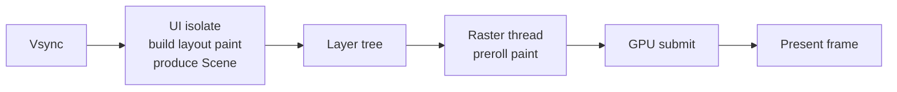

# Performance, Rendering, Memory, And Concurrency

Use this reference when diagnosing jank, rebuild storms, frame budget failures, image/cache memory growth, expensive paint/layout work, isolates, native profiling, or profile-mode measurement claims.

## Performance Profiling And Platform-Specific Optimization

#### Performance profiling and optimization

Flutter is performant by default, but the official docs are blunt about measurement: almost all performance debugging should be done on a **physical device** with the app in **profile mode**, because debug mode, simulators, and emulators are not representative of release behavior. Flutter aims for 60 FPS, and frames should render in roughly **16 ms** on 60 Hz devices; 120 Hz devices push that target lower. DevTools’ Performance view exposes frame timing, UI-thread work, raster-thread work, jank, and build/layout/paint tracing.

| Technique | Why it matters | Review question |
|---|---|---|
| Profile on physical devices in profile mode | Debug/simulator behavior is misleading | Was this measured in profile mode on real hardware? |
| Use DevTools Performance view | Shows per-frame UI/raster timing and jank causes | Is there trace evidence for claimed performance? |
| Keep builders pure and limit rebuild scope | Rebuild storms are a common jank source | Does this builder create state/IO or just UI? |
| Prefer `const` and immutable state | Reduces churn and clarifies change boundaries | Could this subtree/state object be const/immutable? |
| Use lazy lists | Avoid building offscreen children | Is `ListView.builder`/`GridView.builder` used for long lists? |
| Offload heavy compute to isolates | Prevent UI isolate stalls and jank | Is JSON parse/image processing blocking the main isolate? |
| Avoid expensive paint operations | `Opacity`, `saveLayer`, some clipping patterns are costly | Are we animating opacity or forcing expensive raster work? |
| Use Impeller-aware rendering expectations | Shader behavior/runtime changed; Impeller is the default on iOS and Android API 29+ | Are raster assumptions current for target devices? |
| Measure startup explicitly on Android | TTID/TTFD and cold/warm/hot starts are user-visible | Are startup regressions measured, not guessed? |

On Flutter internals, the key mental model is that the **UI thread** executes Dart code and the framework, while the **raster thread** executes rendering via the engine. If the raster thread is slow, it is still usually because something in your Dart/UI decisions produced an expensive scene. DevTools surfaces those different threads explicitly.

#### Platform-specific optimizations

On **Android**, use Android Studio profilers and Perfetto/system tracing to inspect startup, CPU, memory, battery, and frame timing. Android’s performance docs define **cold**, **warm**, and **hot** starts, recommend optimizing with a **cold start** assumption, and distinguish **time to initial display** from **time to fully drawn**. Android’s broader performance guidance also sets startup goals, including a cold start target under 500 ms as an aspirational goal. Flutter’s Android release guide also points directly at code shrinking with **R8** for release builds.

On **iOS**, use Xcode Instruments for unresponsiveness, hangs, and related performance bottlenecks; Apple’s current tooling also highlights non-UI work on the main thread via Thread Performance Checker. For rendering, account for Flutter’s current engine state: Impeller is the only supported rendering engine on iOS. If you are doing add-to-app, Flutter’s docs recommend pre-warming and reusing a long-lived `FlutterEngine` to reduce first-frame delay and preserve state.

## Rendering, Frame Budgets, Memory, Garbage Collection, And Concurrency

### Rendering, frame budgets, memory, garbage collection, and concurrency

Flutter frames begin with a frame request, wait for vsync, build a scene on the UI side, then rasterize it on the raster thread. The framework produces a `Scene`, the engine translates it into a layer tree, and rasterization converts that layer tree into pixels on a surface. The engine wiki and architecture docs both describe the split between framework-side scene production and engine-side rasterization.



The practical performance rule is unforgiving. Flutter targets 60 fps on standard devices and 120 fps where supported. That means roughly 16.67 ms total per frame at 60 Hz and 8.33 ms total at 120 Hz. Flutter’s performance guidance explicitly recommends thinking in terms of separate build and render work, with about 8 ms each at 60 Hz, and notes that 120 fps effectively halves the total budget.

| Refresh rate | Total frame budget |
|---|---:|
| 60 Hz | 16.67 ms |
| 90 Hz | 11.11 ms |
| 120 Hz | 8.33 ms |

#### The highest-value rendering rules

The official performance docs make four recurring points.

First, use `const` and small widgets, because Flutter can reuse constant widget instances and short-circuit rebuild work. Second, use lazy list and grid builders so only visible content is built initially. Third, avoid intrinsic layout passes in large collections, because they force extra measurement work. Fourth, be suspicious of `saveLayer()`, opacity, clipping, and expensive shader effects. These are among the most consistent jank sources in real apps.

`saveLayer()` is expensive because it allocates an offscreen buffer and can force disruptive render-target switches on mobile GPUs. The docs explicitly call out `ShaderMask`, `ColorFilter`, some `Chip` states, and certain `Text` overflow shaders as widgets that may trigger it. Use DevTools or the performance overlay’s checkerboarding for offscreen layers to catch it.

Opacity is likewise called out as expensive. Flutter’s best-practices page recommends using `Opacity` only when necessary, drawing with semitransparent colors where possible, and using `FadeInImage` or the dedicated animated APIs instead of wrapping everything in an opacity layer. Animated opacity can still cost because it often requires intermediate buffering.

Some well-known widget-level pitfalls are literally documented in the API. `DataTable` can be expensive because columns are measured twice and `SingleChildScrollView` mounts and paints the whole child; wrapping large numbers of `ListTile`s individually with `Material` is expensive; `ListenableBuilder` and `AnimatedBuilder` are more efficient when the builder gets a stable `child` subtree that does not depend on the listenable. These are excellent review comments because they are both concrete and source-backed.

A clean rendering refactor:

```dart
// Bad: heavy child rebuilt on every tick.
AnimatedBuilder(
  animation: controller,
  builder: (context, _) {
    return Transform.scale(
      scale: controller.value,
      child: const ExpensiveCardGrid(),
    );
  },
);

// Good: stable child passed separately.
AnimatedBuilder(
  animation: controller,
  child: const ExpensiveCardGrid(),
  builder: (context, child) {
    return Transform.scale(
      scale: controller.value,
      child: child,
    );
  },
);
```

That optimization is directly called out in the `ListenableBuilder`/`AnimatedBuilder` docs.

#### Memory, image caches, textures, and retained objects

Dart uses managed memory with garbage collection. In Flutter, however, “memory” is not just Dart heap. DevTools’ Memory view explicitly tracks both heap and external memory, which matters because images, textures, native buffers, and engine resources can dominate memory even when Dart heap seems fine.

The image system is one of the biggest hidden memory sinks. Flutter’s `ImageCache` is an LRU cache with defaults of up to 1000 images and up to 100 MB, and it separately tracks “live” images whose listener counts have not yet dropped to zero. That means an image can stay alive beyond the ordinary LRU behavior if something still listens to it. `precacheImage()` exists to warm the cache intentionally; `evict()` and cache `clear()` exist for explicit cleanup. `ImageSizeInfo` exists specifically to compare decoded image size in memory with the size actually needed for display, which is a strong hint that over-decoding is worth measuring.

For video, camera, and certain native rendering integrations, prefer `Texture` when possible. Flutter’s `Texture` widget is backed by a registered texture ID, repaints autonomously as frames arrive, and typically does so without executing Dart code. It also exposes `freeze` to stop updates and `filterQuality` to trade quality for speed when scaling. That is materially different from inserting a platform view into a composition-heavy scene.

#### Concurrency and isolates

Every Dart isolate has separate memory and communicates by message passing. Flutter apps run most work on the main isolate; isolates are for work that exceeds the frame gap. Flutter’s current concurrency docs are very specific about the intended use cases: parsing large files, processing media, local database work, compression, and other large computations that would otherwise block the UI.

Use `compute()` or `Isolate.run()` for one-shot heavy work, but do not fetishize isolates. Spawning isolates has overhead, messages are copied unless immutable ownership-transfer paths are used, and a long-lived worker isolate is only worth it when repeated heavy work amortizes that cost. Flutter’s docs also warn that spawned isolates cannot use `rootBundle` or `dart:ui`, that plugin usage in isolates requires `BackgroundIsolateBinaryMessenger`, and that unsolicited plugin messages from the host are not supported in background isolates. That last limitation matters for realtime listeners and some SDKs.

A good review rule is simple: if a task can fit comfortably inside the frame gap and does not happen frequently, keep it on the main isolate for simplicity. If it is large, repeatable, or media-heavy, move it off the UI isolate. But never move UI ownership itself off the main isolate. Flutter’s docs are explicit that widget/UI work and `rootBundle` access remain coupled to the main isolate.
